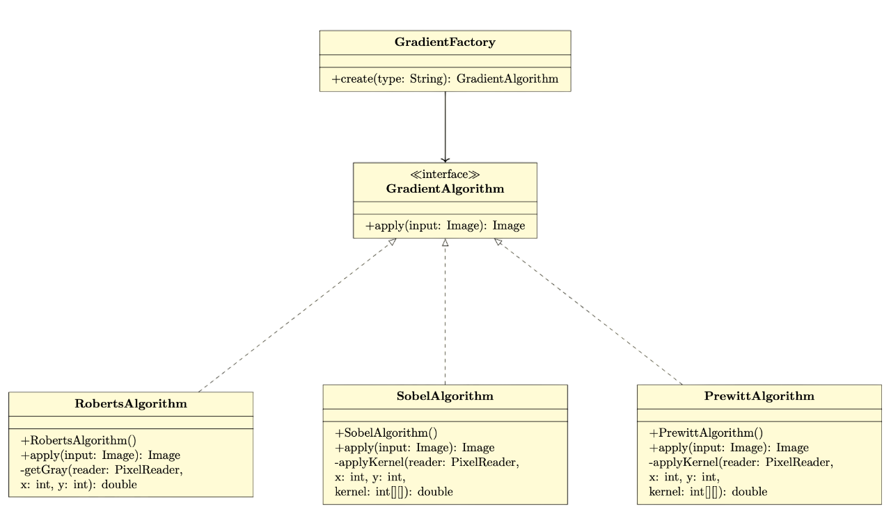
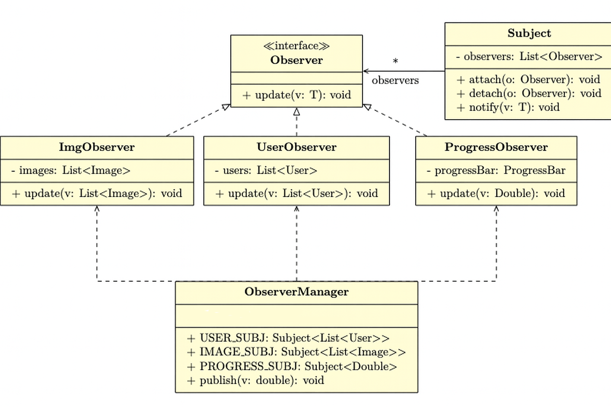
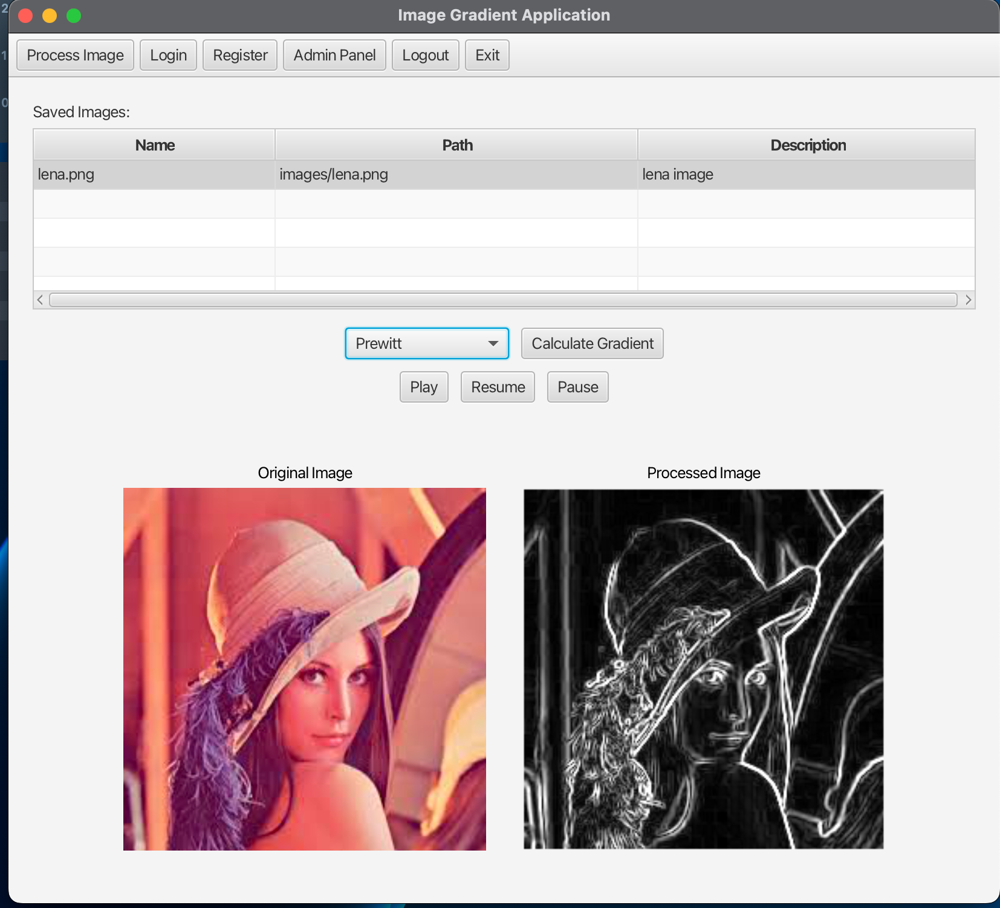

## 🖼️ Image Gradient Calculation

A software application to calculate the **image gradient** using algorithms such as **Sobel**, **Prewitt**, and more. The architecture applies the **Factory Method** and **Observer** design patterns and features a GUI to load images and display results, with optional database support.

---
##  Goal

Build a modular and extensible application that:
- Supports gradient algorithms (Sobel, Prewitt, Roberts)
- Uses **Factory** and **Observer** patterns
- Displays processing progress (via GUI or console)
- Allows saving of results and images

---
##  Algorithm Descriptions

### Sobel

Uses 3×3 convolution kernels to approximate image gradients. Offers smoothing to reduce noise sensitivity and is widely used for edge detection.
### **Sobel Masks (3×3)**

### Horizontal Gradient \( $G_x$ \)
$$ 
G_x = 
    \begin{bmatrix} - 1 & 0 & +1 \\ -2 & 0 & +2 \\ -1 & 0 & +1 \end{bmatrix}
$$

### Vertical Gradient \( $G_y$ \)
$$
G_y = \begin{bmatrix} -1 & -2 & -1 \\ 0 & 0 & 0 \\ +1 & +2 & +1 \end{bmatrix}
$$

### Gradient Magnitude

The overall gradient magnitude at each pixel is calculated as:

$$
G = \sqrt{G_x^2 + G_y^2}
$$

### Prewitt
The Prewitt operator is similar to Sobel but uses a simpler kernel without smoothing.
It’s computationally faster but more sensitive to noise.

## **Prewitt Masks (3×3)**

### Horizontal Gradient \( $G_x$ \)
$$
G_x =
    \begin{bmatrix}
    -1 & 0 & +1 \\
    -1 & 0 & +1 \\
    -1 & 0 & +1
    \end{bmatrix}
$$

### Vertical Gradient  $G_y$
$$
G_y =
    \begin{bmatrix}
    -1 & -1 & -1 \\
    0 & 0 & 0 \\
    +1 & +1 & +1
    \end{bmatrix}
$$

### Gradient Magnitude

The overall gradient magnitude at each pixel is calculated as:

$$
G = \sqrt{G_x^2 + G_y^2}
$$


### Roberts
The Roberts Cross operator is one of the earliest edge detectors, using 2×2 kernels.
It is highly sensitive and efficient, suitable for detecting sharp edges.

## Roberts Masks (2×2 Kernels)

#### Horizontal Gradient ($G_x$)

$$
G_x = \begin{bmatrix}
+1 & 0 \\
0 & -1 \\
\end{bmatrix}
$$

#### Vertical Gradient ($G_y$)

$$
G_y = \begin{bmatrix}
0 & +1 \\
-1 & 0 \\
\end{bmatrix}
$$

### Gradient Magnitude

The overall gradient magnitude at each pixel is calculated as:

$$
G = \sqrt{G_x^2 + G_y^2}
$$

---
## Design Patterns Used

### Factory Method

- **Purpose**: Dynamically create the algorithm based on user choice (e.g., "sobel").
- **Benefits**: Clean, sacalable, and extensible code.

### Observer

- **Purpose**: Automatically update UI elements like progress bars or logs during image processing.
- **Benefits**: Decouples computation logic from presentation logic.

---

### Project Architecture
```text
GradientApp/
│                  
├── images/                                 
├── src/
│   ├── main/
│   │   ├── java/
│   │   │   └── com/example/gradient/
│   │   │       ├── algorithm/         
│   │   │       ├── core/               
│   │   │       ├── database/          
│   │   │       ├── factory/            
│   │   │       ├── observer/           
│   │   │       └── ui/                  UI (MVC: controller, view, model)
│   │   └── resources/
│   └── test/
│       └── java/com/example/gradient/  → Unit tests by module
└── pom.xml

```


[#### Implementations:
- `Sobel`, `Prewitt`, `Roberts` implement `AlgoritmGradient`
]()

### `AlgorittmGradient`
```java
    public interface GradientAlgorithm {
        public Image apply(Image input);
    }
```
### `SobelAlgorithm`
```java
@Override  
public Image apply(Image input) {  
    int width = (int) input.getWidth();  
    int height = (int) input.getHeight();  
  
    WritableImage output = new WritableImage(width, height);  
    PixelReader reader = input.getPixelReader();  
    PixelWriter writer = output.getPixelWriter();  
  
    IntStream.range(1, height - 1).parallel().forEach(y ->  
            IntStream.range(1, width - 1).forEach(x -> {  
                double gx = applyKernel(reader, x, y, SOBEL_X);  
                double gy = applyKernel(reader, x, y, SOBEL_Y);  
                double magnitude = Math.min(1.0, Math.sqrt(gx * gx + gy * gy)); /
                Color resultColor = new Color(magnitude, magnitude, magnitude, 1.0);  
                writer.setColor(x, y, resultColor);  
            })  
    );  
  
    return output;  
}
```

```java
private double applyKernel(PixelReader reader, int x, int y, int[][] kernel) {  
    return IntStream.range(-1, 2).boxed()  
            .flatMap(dy -> IntStream.range(-1, 2)  
                    .mapToObj(dx -> {  
                        Color color = reader.getColor(x + dx, y + dy);  
                        double gray = (color.getRed() + color.getGreen() + color.getBlue()) / 3.0;  
                        return gray * kernel[dy + 1][dx + 1];  
                    }))  
            .mapToDouble(Double::doubleValue)  
            .sum();  
}
```

### `RobertsAlgorithm`
```java
public class RobertsAlgorithm implements GradientAlgorithm {  
  
    @Override  
    public Image apply(Image input) {  
        int width = (int) input.getWidth();  
        int height = (int) input.getHeight();  
  
        WritableImage output = new WritableImage(width, height);  
        PixelReader reader = input.getPixelReader();  
        PixelWriter writer = output.getPixelWriter();  
  
        IntStream.range(0, height - 1).parallel().forEach(y ->  
                IntStream.range(0, width - 1).forEach(x -> {  
                    double gx = getGray(reader, x, y) - getGray(reader, x + 1, y + 1);  
                    double gy = getGray(reader, x + 1, y) - getGray(reader, x, y + 1);  
                    double magnitude = Math.min(1.0, Math.sqrt(gx * gx + gy * gy));  
                    writer.setColor(x, y, new Color(magnitude, magnitude, magnitude, 1.0));  
                })  
        );  
  
        return output;  
    }  
  
    private double getGray(PixelReader reader, int x, int y) {  
        Color color = reader.getColor(x, y);  
        return (color.getRed() + color.getGreen() + color.getBlue()) / 3.0;  
    }  
}
```
### `PrewittAlgorithm`
```java
@Override  
public Image apply(Image input) {  
    int width = (int) input.getWidth();  
    int height = (int) input.getHeight();  
  
    WritableImage output = new WritableImage(width, height);  
    PixelReader reader = input.getPixelReader();  
    PixelWriter writer = output.getPixelWriter();  
  
    // Process all pixels excluding the border pixels (needed for kernel 3x3)  
    IntStream.range(1, height - 1).parallel().forEach(y ->  
            IntStream.range(1, width - 1).forEach(x -> {  
                double gx = applyKernel(reader, x, y, KERNEL_X);  
                double gy = applyKernel(reader, x, y, KERNEL_Y);  
                double magnitude = Math.min(1.0, Math.sqrt(gx * gx + gy * gy));  
                writer.setColor(x, y, new Color(magnitude, magnitude, magnitude, 1.0));  
            })  
    );  
  
    return output;  
}

private double applyKernel(PixelReader reader, int x, int y, int[][] kernel) {  
    return IntStream.range(0, 3).boxed().flatMapToDouble(j ->  
            IntStream.range(0, 3).mapToDouble(i -> {  
                Color color = reader.getColor(x + i - 1, y + j - 1);  
                double gray = (color.getRed() + color.getGreen() + color.getBlue()) / 3.0;  
                return gray * kernel[j][i];  
            })  
    ).reduce(0, Double::sum);  
}

```

--- 
#### `FactoryGradient`
```java
public class GradientFactory {
    public static GradientAlgorithm create(String type) {
        return switch (type.toLowerCase()) {
            case "sobel" -> new SobelAlgorithm();
            case "prewitt" -> new PrewittAlgorithm();
            case "roberts" -> new RobertsAlgorithm();
            default -> throw new IllegalArgumentException("Type of algorithm unknown: " + type);
        };
    }
}
```
--- 

### Observer Pattern



#### ` Observer<T>` 
```java

public interface Observer<T> {
    void update(T value);
}
```
---
#### `ImageListObserver`
```java
    public class ImageListObserver implements Observer<List<ImageEntity>> {
    private final ObservableList<ImageEntity> observableImages;

    public ImageListObserver(ObservableList<ImageEntity> observableImages) {
        this.observableImages = observableImages;
    }

    @Override
    public void update(List<ImageEntity> images) {
        Platform.runLater(() -> {
            observableImages.setAll(images);
        });
    }
}
```
---
#### `ProgressBarObserver`
```java
    public class ProgressBarObserver implements Observer<Double> {

    private final ProgressBar progressBar;

    public ProgressBarObserver(ProgressBar progressBar) {
        this.progressBar = progressBar;
    }
    
    @Override
    public void update(Double value) {
        Platform.runLater(() -> progressBar.setProgress(value));
    }
}
```
---
#### `ProgressBarObserver`
```java 
public class UserListObserver implements Observer<List<User>> {  
    private final ObservableList<User> userList;  
  
    public UserListObserver(ObservableList<User> userList) {  
        this.userList = userList;  
    }  
  
    @Override  
    public void update(List<User> data) {  
        Platform.runLater(() -> {  
            userList.setAll(data);  
        });  
    }  
}

```
#### `ObserverManager`
```java
    public final class ObserverManager {
        public static final Subject<List<User>> USERS_SUBJECT   = new Subject<>();
        public static final Subject<List<ImageEntity>> IMAGES_SUBJECT = new Subject<>();
        public static final Subject<Double> PROGRESS_SUBJECT  = new Subject<>();
    
        private ObserverManager() {}
    
        public static void publishProgress(double value) {
            PROGRESS_SUBJECT.notifyObservers(value);
        }
    }
```

---

#### **`Subject<T>`**
```java
public class Subject<T> {
private final List<Observer<T>> observers = new ArrayList<>();

    public void addObserver(Observer<T> observer) {
        observers.add(observer);
    }

    public void removeObserver(Observer<T> observer) {
        observers.remove(observer);
    }

    public void notifyObservers(T value) {
        for (Observer<T> observer : observers) {
            observer.update(value);
        }
    }
}
```

## Database Structure

The application uses MySQL to persist user and image metadata.

### Tables:

#### `Users`
| Field    | Type         | Description            |
| -------- | ------------ | ---------------------- |
| `id`     | INT (PK)     | Auto-increment user ID |
| name     | VARCHAR(255) |                        |
| surname  | VARCHAR(255) |                        |
| email    | VARCHAR(255) |                        |
| password | VARCHAR(255) | Hashed password        |

#### `Images`
| Field         | Type         | Description                  |
| ------------- | ------------ | ---------------------------- |
| `id`          | INT (PK)     | Auto-increment image ID      |
| `path`        | TEXT         | File path                    |
| `id_user`     | INT (FK)     | References `users(id)`       |
| `description` | VARCHAR(255) | Image description (optional) |

## Implementation of methods for connection to DB
```java
public class DBConfig {  
    public static final String DB_HOST = "localhost";  
    public static final String DB_PORT = "8889";  
    public static final String DB_NAME = "gradient_app";  
    public static final String USER = "root";  
    public static final String PASSWORD = "root";  
    private DBConfig() {}  
}

```

```java
public class DBConnection {  
    public static Connection getConnection() throws SQLException {  
        String url = "jdbc:mysql://" + DBConfig.DB_HOST + ":" + DBConfig.DB_PORT + "/" + DBConfig.DB_NAME;  
        return DriverManager.getConnection(url, DBConfig.USER, DBConfig.PASSWORD);  
    }  
}

```
The database connection logic is encapsulated in a dedicated `config_connection` package to separate concerns and improve modularity.
In the same package, there are all the classes responsible for database CRUD operations.
```java 
  
public interface ImageDAO {  
    void insertImage(ImageEntity imageEntity);  
    void updateImage(ImageEntity imageEntity);  
    void deleteImage(int id);  
    ImageEntity getImageById(int id);  
    List<ImageEntity> getAllImages();  
    List<ImageEntity> searchImages(String query);  
}

```

```java
public interface UserDao {  
    void createUser(User user);  
    User getUserByUsername(String username);  
    User getUserByEmail(String email);  
    User getUserById(int id);  
    void updateUser(User user);  
    void deleteUser(int id);  
    User getUserByUsernameAndPassword(String username, String password);  
    ArrayList<User> getAllUsers();  
}

```
### Logic of Using Threads

This application makes extensive use of threads to perform background operations, particularly for CRUD tasks such as fetching all users or images. The main objective is to **keep the JavaFX UI thread responsive** by offloading time-consuming operations (like database access) to separate threads.

### Example: Loading Images from the Database Using `Task`

```java
private void loadImagesFromDB() {
    Task<List<ImageEntity>> task = new Task<>() {

        @Override
        protected List<ImageEntity> call() throws Exception {
            ImageDAO imageDAO = new ImageRepository();
            return imageDAO.getAllImages();
        }

        @Override
        protected void succeeded() {
            ObserverManager.IMAGES_SUBJECT.notifyObservers(getValue());
        }

        @Override
        protected void failed() {
            System.err.println("Error in images load: " + getException());
        }
    };
    new Thread(task).start();
}
```


## JavaFX Task Integration
The `javafx.concurrent.Task` class is used to properly integrate background operations with the JavaFX application thread.

- The `succeeded()` method is automatically executed on the **JavaFX Application Thread**, making it safe to update UI components.
- The call to `notifyObservers(getValue())` triggers updates to any components observing changes, following the **Observer pattern**.

This approach ensures that long-running operations (like database queries) do not block the main UI thread, maintaining application responsiveness.

---

### `ThreadTask` Custom Thread Wrapper for Managed Background Execution

The `ThreadTask` class provides a lightweight abstraction over Java’s `Thread`, designed to **manage and monitor the lifecycle of a background task** in a structured and reusable way.

#### Purpose

This utility class is intended to:

- Execute a `Runnable` task in a separate thread
- Automatically track the task’s start and completion state
- Support an optional `onFinished` callback to execute custom logic when the task ends
- Provide full access to standard `Thread` controls (e.g., `interrupt`, `name`, `priority`)
- Attach a unique identifier (`UUID`) to each task instance for easier debugging and tracking

#### Purpose
This utility class is intended to:

- Execute a `Runnable` task in a separate thread
- Automatically track the task’s start and completion state
- Support an optional `onFinished` callback to execute custom logic when the task ends
- Provide full access to standard `Thread` controls (interrupt, join, name, priority)
- Attach a unique identifier (UUID) to each task instance for easier debugging and tracking

### Example Usage
```java
private Runnable wrapTask(Runnable originalTask) {
        return () -> {
            started.set(true);
            try {
                originalTask.run();
            } catch (Exception e) {
                e.printStackTrace();
            } finally {
                finished.set(true);
                if (onFinishedCallback != null) {
                    onFinishedCallback.run();
                }
            }
        };
    }
```
| Method             | Description                                          |
| ------------------ | ---------------------------------------------------- |
| `start()`          | Starts the thread and begins execution               |
| `join()`           | Waits for the task to complete                       |
| `interrupt()`      | Interrupts the running thread                        |
| `isStarted()`      | Returns `true` if the task has started               |
| `isFinished()`     | Returns `true` if the task has completed             |
| `setOnFinished()`  | Sets a callback to be called after the task finishes |
| `getId()`          | Returns the unique ID (`UUID`) of the task           |
| `getThread()`      | Returns the internal thread instance                 |
| `setPriority(int)` | Sets thread priority                                 |
| `setName(String)`  | Sets thread name                                     |
--- 
## Session Use Example

The `UserSession` class is a simple static utility used to manage the currently logged-in user across the application. It allows any part of the application to access or modify the active session state.
### Class Definition
```java
import com.example.gradient.database.User;

public class UserSession {
    private static User currentUser;

    public static void setCurrentUser(User user) {
        currentUser = user;
    }

    public static User getCurrentUser() {
        return currentUser;
    }

    public static void clear() {
        currentUser = null;
    }
}

```
## Example Use  of Application 
### 1. Sobel Algorithm


Use of Sobel Algorithm to calculate gradient of Lena Image

### 2. Prewitt Algorithm
   
Use of Prewitt Algorithm to calculate gradient of Lena Image

### 3. Roberts Algorithm
   
   
Use of Roberts Algorithm to calculate gradient of Lena Image

##  Testing Strategy

This project uses JUnit 5 for unit testing. Key areas tested include:

- Gradient algorithm correctness (Sobel, Prewitt, Roberts)
- Factory behavior and exception handling
- Observer notifications and UI updates
- DAO/database CRUD operations (mocked)
- Controller behavior

> All test classes are located in `src/test/java/com/example/gradient/`.

---

## Maven Dependencies Explained
This project uses Java 17+ and JavaFX 21 to build a GUI-based image gradient application with optional database and testing support.

### Required Libraries
| Dependency          | Purpose                                                                                                     |
| ------------------- | ----------------------------------------------------------------------------------------------------------- |
| `javafx-controls`   | Provides UI components like `Button`, `Label`, `ImageView`, and more for building the JavaFX GUI.           |
| `javafx-swing`      | Allows interoperability between Swing and JavaFX components. Useful if integrating legacy Swing components. |
| `javafx-base`       | Base module for JavaFX — includes essential utilities, collections, and binding APIs used internally.       |
| `mysql-connector-j` | Provides support for connecting to a MySQL database. Useful for saving results or logging images.           |
| `junit-jupiter`     | The JUnit 5 testing framework. Used for unit testing gradient algorithms or observer behaviors.             |

## Plugins
| Plugin                | Purpose                                                                                                                           |
| --------------------- | --------------------------------------------------------------------------------------------------------------------------------- |
| `javafx-maven-plugin` | Enables JavaFX applications to be compiled and run using Maven. It handles module-path configuration automatically.               |
| `jacoco-maven-plugin` | Adds code coverage tracking to tests. Generates reports showing which lines of code are covered or not after running  test suite. |


## How to Build and Run

### Prerequisites
- Java 17+ 
- Maven 3.8+
- MySQL server active

### Run Locally

```bash
git clone https://github.com/tuo-repo/GradientApp.git
cd GradientApp
mvn clean javafx:run
```

## How to Make Tests with JUnit 5
This section explains how to write, organize, and run unit tests for the Image Gradient application using JUnit 5. The tests cover gradient algorithm correctness, factory behavior, observer updates, and database operations.
### Run All Tests with Maven

```bash
mvn clean test -e
```
## How to use `JaCoco `plugin 
1. Add the JaCoCo plugin to your pom.xml. This plugin automatically tracks which parts of the code are executed when tests run.
2. Generate the coverage report by running:
    ```bash
      mvn clean verify
    ```
3. After test execution, the coverage report will be available at:
    ```bash
    target/site/jacoco/index.html
    ```
4. Open The HTML file in a browser to view details coverage statistic
##  Commit & Merge Standards


---

###  Activity

[View GitHub Commit Activity](https://github.com/luigicast0408/IngegneriaDelSoftware_IDS/graphs/commit-activity)   
[Contributors Graph](https://github.com/luigicast0408/IngegneriaDelSoftware_IDS/graphs/contributors)

###  Commit Rules
I follow [Conventional Commits](https://www.conventionalcommits.org/en/v1.0.0/) to keep the Git history clean and automatable.


 