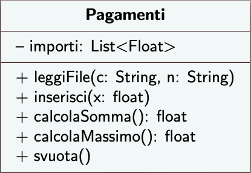

# 3° lezione IDS

Due Date: March 10, 2025
Status: Done
Argomenti: Refactoring
Categoria Desing Pattern: Desing Pattern Comportamentali, Desing Pattern di Progettazione, Desing Pattern di Test
MicroArgomenti: Metodo Command e Query, Spaghetti Code, UML

## Riepilogo Lezione Precedente

## Spaggetti Code

Si quando un metodo esegue più operazioni contemporaneamente, questo rende il codice difficile da revisionare quindi poco leggibile, poco modificabile e poco testabile.  Dal punto di vista dell’ IDS è strettamente necessario eseguire dei test. Questo deriva dal fatto che non si è tenuto conto della OOP ma ci si è basi sulla programmazione procedurale.

Quando si programma ad oggetti bisogna analizzare i requisiti (le richieste da parte del cliente), con la successiva individuazione di classi e metodi che deve avare ogni singola classe. Al nome della classe viene associato il sostantivo, invece, i nomi dei metodi sono dei verbi ad esempio `calcolaMax()`. 

I nomi degli attribuiti devono essere dei sostantivi. Può capiate che non si trovi il nome per un metodo, questo può essere dato dal fatto che il metodo in questione esegue più operazioni contemporaneamente. In questo caso bisogna scorporare  il metodo in più parti. Alcune volte può succedere che si vuole cambiare il nome della classe dovuto ad uno spostamento del codice, o anche perché si campisce meglio cosa bisogna far eseguire ad una specifica classe o ad uno specifico metodo. È buona cosa farlo in fase di progettazione e implementazione. Una volta implementata una classe non si ha una versione definita ma si cerca sempre di migliorarla.

## Diagrammi UML



Si ha un rettangole che identifica la classe e i suoi attributi(caratteristiche) ma anche i metodi della classe(azioni)

Si hanno 3 tipi di visibilità:

- **pubblica $(+)$** visibile sia alle classi che alle sotto classi
- **privata $(-)$** visibile solo alla classe in cui è stata create
- **protetta $(*)$** visibile solo alla classe in cui è stata creata e alle sotto classi

## Come si rappresentano gli attributi nel UML?

Gli attributi vengono rappresentati con l’identificatore di visibilità, il nome dell’ attributo e il tipo. Esempio `+tot: float` .

## Come si rappresentano i metodi nell’UML?

I metodi vengono rappresentati con  l’identificatore di visibilità, il nome del metodo e la lista dei parametri formali(variabili senza valore) o in ingresso del metodo formati a sua volta dal tipo e dal nome della variabile.

- `+calcolaMax(num1,num2)` procedura (non ritorna nulla
- `+calcolaMax(num1,num2):float` ritorna un parametro

L’UML non è la versione definitiva delle classi e del vari metodi, alcuni dettagli possono essere omessi.  I diagrammi UML non vanno trascurati perché sono un sistema molto importante per la progettazione di un sistema software. Non bisogna utilizzare i tool per UML.  l’UML serve ad eliminare qualche dettaglio e a dare una visuale di insieme. È il progettista che ha il compito di capire quali dettagli sono necessari rappresentare e quali no.

## Metodo Command and Query

- **Metodo Command**: calcola il dato
- **Metodo Query**: viene prelevato un dato pronto

Se si cerca di scindere questi metodi(azioni) se ne avranno alcuni che eseguono del lavoro ed altri che vanno a leggere i risultato dell’esecuzione di altri metodi. In tal modo il secondo metodo si può chiamare più volte in quando l’accesso al dato già pronto avviene in tempo costante. Cosi facendo non si sprecano risorse e non si affaticano componenti. Nel primo metodo, invece, l’esecuzione del metodo ha un spreco di risorse perché  si sta calcolando un dato.

## Come si distingue un metodo Command da un metodo Query

- **Il metodo command:** crea metodo che non ritorna nessun valore, ma modifica lo stato dell’ oggetto.
- **Il metodo query**: crea un metodo che ha un parametro di ritorno, non modificano lo stato dell’oggetto

Questo metodo viene utilizzato anche quando è necessaria un esecuzione in parallelo, bisogna prestare attenzione a quando si utilizzano i dati perché potrebbe esserci qualcun altro che sta usando gli questi nello stesso momento. Per ovviare a questo problema si esegue la seguente strategia: Si parte eseguendo una certa fase dei metodi di tipo command e poi si fanno partire gli esecutori in parallelo leggono lo stato si è risolto il problema.

Una miglioria in termini di cicli può essere quella di usare il **`foreach ()`** invece del `for()` classico nel seguente modo:

```java
for(String importo : importiLetti){}
```

Questa miglioria permette di evitare di commettere errori con gli indici andando magari fuori della dimensione della lista stessa. Se si volesse, invece, accedere tramite indice ai vari elemti della lista

```java
for(int i=0; i < 10; i++){
	importiLetti.get(i)...
}
```

## Come si confrontano i codici?

Ipotizziamo di prendere due versioni dello stesso codice e di confrontarle.

## Con quali metriche si confrontano?

Si possono confrontare  dal punto di vista della modalità ma anche dalle linee di codice.

## Con quali criteri contiamo le linee di codice di un programma?

Non vi sono dei criteri standard è a discrezione del programmatore. Si  hanno diversi modi per contare le linee di codice ma l’importante è che ci sia consistenza all’interno dell’intero progetto(questi criteri che vengono stabiliti devono essere mantenuti).

Esempio: Ivan non conta le righe vuote come codice (viceversa per Luigi che conta anche i ; ) mentre
Mary conta anche le righe di codice usate per dare una buon indentazione

**Mary:**

```java
public void svota(){
	importi = new ArrayList<>();
}
```

**Francesco:**

```java
public void svota(){importi = new ArrayList<>();}
```

Una strategia potrebbe essere contare i `;` 

Il nome del metodo indica cosa fa e non vanno messi troppi commenti mentre per un metodo lungo è sicuramente necessario.

JUNIT è un framework che permette di esegue dei test.

Contiene 

- 22k LOC
- 231 classi
- 1200 metodi
- 265 attributi

Per il conteggio sono state contante tutte le linee di codice e non i `;` .

## I TEST

I metodi che consentono di osservare lo stato interno dell’oggetto che si sta usando. L’osservabiltà è una proprietà necessaria per scrivere dei test.

<aside>
💡

**Che cos’è un test?**

Un test è un programma che esegue il codice sotto certe condizioni(da un contesto di esecuzione, da dei valori in ingresso, inizializza delle variabili prima di chiamare il metodo) e valuta  se il risultato fornito è corretto (se non lo fosse ci sono errori nel programma).

</aside>

 Dopo la scrittura dei test questi si valutano con i risultati presenti sul documento dei requisitivi.

Il codice se è scritto bene, allora,  se si dovesse cambiare macchina considerando sempre i medesimi test questi dovrebbero fornire un risultato coretto.

I test devono hanno due caratteristiche fodamnetali:

- **Autovalutanti**: chiunque legga il codice deve poterne capire il senso dei test effettuati, inoltre devono essere sempre visibili **`System.out.println("TEST");`**
- **Indipendenti**: Il risultato di un test non deve dipendere dall’altro test.  Esempio: supponiamo di avere due test: test1, test2. Il risultato di test2 non deve dipendere da quello di test1. Si ha un anomalia quando ad esempio si hanno due test con lo stesso output con metodi diversi.

## La tecnica TDD (Test-Drive Development)

Il **Test-Driven Development (TDD)** è una metodologia che suggerisce di scrivere prima i test e poi il codice necessario per soddisfarli. Questo approccio aiuta a scrivere codice più affidabile, evitando errori e facilitando la manutenzione.

1. **Scriviamo un test prima di implementare il codice**
2. **Facciamo fallire il test (perché il codice non esiste ancora)**
3. **Scriviamo il codice minimo per far passare il test**
4. **Eseguiamo il refactoring del codice per migliorarlo senza rompere i test**

Si hanno due esiti per i test:

- Red:  test non andato a buon fine
- Green: tutti i test sono andati a buon fine, questa situazione se la struttura non soddisfa si potrebbe eseguire del refactoring.

Vi  sono diversi principi che verranno trattati in tutto il corso

- **Principio di singola responsabilità(SRT)**
    
    Ogni classe ha una singola responsabilità (piccolo compito) che deve assolvere. Come detto  prima, se si ragiona poco sul nome e provabile che soddisfi questa proprietà. È  consigliato di scrivere un commento per far comprendere agli altri quale compito svolge la classe o anche il metodo senza omettere le informazioni fondamentali, ma eliminando dettagli troppo profondi. Nel commento se usiamo la congiunzione e troppe  virgole è sbagliato perché vol dire che il metodo sta eseguendo più azioni contemporaneamente e si perde la coesione nel codice. Ne consegue che l’uso della classe e dell’ereditarietà sarà più semplice. Ciò detto vale anche per i metodi delle classi.
    
- **Astrazione**
    
    Quando si progetta in termini di OOP, si utilizza il concetto di **astrazione**. Ciò vuol dire che si prende la realtà di riferimento e la si analizza, individuando quali sono i **sostantivi** che probabilmente verranno trasformati in **classi**. A queste classi si aggiungono le caratteristiche della realtà di riferimento che si sta analizzando, ossia **attributi** e **metodi**, che rappresentano rispettivamente le proprietà e le azioni degli oggetti. Esempio si vuole realizzare un sistema software scolastico si prenderà come realtà di riferimento, la scuola.
    
- **KISS((Keep It Simple, Stupid)**
    
    Scrivi un algoritmo semplice piuttosto che molte cose complicate per fare il fenomeno. Il
    codice deve essere sempre facilmente leggibile
    
- **DRY(Don't Repeat Yourself))**
    
    Evita le duplicazioni del codice. 
    
    Vi sono duplicazioni? 
    
    Si, allora procedo ad eliminarle.
    
    Supponiamo di avere un ciclo per calcolare un dato  che verra ottenuto in un altro sottoprogramma. Bisogna trovare il modo di calcolarlo una volta sola. Così si evita di ripetere codice inutilmente.
    
- **YAGNI((You Ain't Gonna Need It))**
    
    Se si riesce ad eseguire un test dati dei requisiti e questi vengono sodisfatti non si scrive  altro codice. Se non si sono sodisfatti tutti i requisiti bisogna scriverlo.
    

I tre principi di cui sopra vanno insieme di solito

- **LOD(Law of Demeter)**
    
    Una classe non deve interagire con tutte le classi. Qualora si ipotizza che ci potrebbe essere un interazione si va ad inserire nell’interfaccia. Una classe che interagisce con 6 classi non va bene.
    

## Principi per i Test

- **FIRST(Fast Indipendent Repeatable Self-validating Timely**
    
    Un test dovrebbe essere veloce, il tempo di esecuzione non dovrebbe essere eccessivo. Si deve investigare su una piccola parte del codice ed il tempo dovrebbe essere più piccolo possibile ma anche isolato e indipendente. Supponiamo di inserire un test dopo tanti metodi. È sbagliato perché non si capisce da quale metodo viene l’errore, è preferibile, invece, mettere un test a metodo per capire se ogni metodo è coretto.
    
- **BBD(Behavior-Driven Development)**
    
    Si utilizza per scrivere bene un test. Per fare cio bisogna rispondere alle seguenti domande
    
    i test vengono scritti in un formato leggibile e strutturato in tre parti principali:
    
    1. **Given** (Dato) → Imposta il contesto iniziale (precondizioni).
    2. **When** (Quando) → Descrive l'azione che viene eseguita.
    3. **Then** (Allora) → Verifica l'output o il risultato atteso.

## Refactoring

È il processo che consente di cambiare il sistema software mantenendo inalterato il suo comportamento cambiandone la struttura interna in modo da migliorarla e rendendo manutenibile (?)il sistema software.

## Se si trova un errore e lo si corregge si sta eseguendo il Refactoring?

No, perché si sta modificando il comportamento

Si deduce che il refactoring serve a due cose:

- migliorare la struttura interna del sistema software
- Correggere eventuali errori se presenti

C’è da sottolineare che sono attività diverse che si stanno svolgendo contemporaneamente.

## Perché il Refactoring è importante?

Prevedere tutto durante la fase di progettazione del sistema software è molto difficile che mette a dura prova anche i progettisti esperti. Per questo motivo si procede nel seguente modo:

- Si inizia eseguendo la progettazione
- Si produce il codice relativo alla progettazione eseguita in precedenza
- Ci si accorge che il posso essere apportate delle migliorie al codice si procede facendo il refactoring.

Ad esempio si potrebbe eliminare del codice duplicato. O anche scorporare parti di codice in modo da rendere il codice più modulare.

Spesso quando si esegue il refactoring si riduce la dimensione del codice o anche che certe linee di codice non verrebbero eseguite e quindi si eliminano. Questi “difetti” spesso sono difficili da trovare bisogna prestare attenzione. 

Se si riducono le linee di codice si avranno meno cose da correggere e il codice diventa più comprensibile.

Un altro vantaggio del refactoring è la rimozione del debito tecnico che a volte per la fretta di consegnare ha il tempo di controllare tutto il codice nonostante conosca la buona programmazione, cerco un modo più diretto per implementarlo, però, a volte, ne sacrifica la modularità e questo lo si nota nel lungo termine, quando lo si vuole aggiornare con nuove funzionalità. Esempio: per mettere un concetto (richiesto dal cliente) invece di implementarlo come classe la implemento come attributo in una pre-esistente.

Si ha a posteriori la necessità di rimodulare tutto ciò che è stato eseguito di fretta ma questo ha un costo perché bisogna pagare le ore che il progettista impiega per sistemare questi “difetti”.

Eseguire Refactoring vuol dire anche scoprire difetti pre-esistenti e si vanno a sistemare.

Si hanno delle tecniche di refactoring che si applicano in base a dei sintomi.

Tutte le tecniche si applicano quando è già  stato scritto il codice per il testing perché non deve mutare il comportamento.  Quando si eseguono dei cambi nel codice è provabile che si è cambiato il comportamento non volutamente quindi è importante eseguire i test per essere certi che questa cosa non  sia avventa. Se i test avvengono tutti con successo vuol dire che non vi è stata nessuna modifica al codice.

## Sintomi

Quando si ha la percezione che si deve passare alla fase di refactoring?

- Quando si ha del codice duplicato (bad small)
- Metodi lunghi, medio lunghi che hanno commenti al loro interno, metodi non troppo lunghi ma con commenti, metodi non troppo lunghi con linee vuote
- Classe Grande bisogna scinderla in piu classi. Non si ha uno standard sul numero di righe che compongono in una una classe ma ad esempio una media di 15 righe è ok più non è consigliabile per i principi definiti in precedenza(Astrazione). Quanti metodi può avere una classe? Al più 30
- **Cambiamenti divergenti:** si verificano quando una classe deve essere modificata per motivi diversi. Questo indica che la classe svolge più di una funzione, violando il principio di **singola responsabilità**. Per risolvere il problema, è necessario suddividere la classe in più classi specifiche (**split**), ciascuna con un unico scopo ben definito.

## Tecnica di Refactoring

- Tecnica (1) Estrai Metodo
    
    Questa tecnica si applica quando una porzione di codice all'interno di un metodo può essere isolata e spostata in un altro metodo separato.
    
    ## Quando si utilizza?
    
    L'estrazione di un metodo si utilizza quando un metodo è **difficile da comprendere** a prima vista, oppure quando servono troppi commenti per spiegarne il funzionamento. Se i nomi dei metodi non sono chiari o appropriati, il **Refactoring** aiuta a rendere il codice più leggibile e intuitivo.
    
    Questa tecnica è particolarmente utile quando i metodi sono **troppo lunghi e complessi** o hanno **troppi obiettivi differenti**. Inoltre, l’**ereditarietà** diventa più efficace con metodi più piccoli, perché facilita l'**overriding** e la manutenzione del codice.
    
    Il refactoring tramite estrazione di metodi permette di apportare **piccoli miglioramenti** al codice, senza cambiarne il comportamento. Separando la logica in metodi più specifici, si riduce il rischio di bug futuri e si semplifica la gestione del codice.
    
    ## Esiste un valore appropriato al metodo?
    
    Sì, un metodo ha un valore appropriato se il **tipo di ritorno** è compatibile con la variabile che lo riceve nel programma chiamante. Se il valore restituito è dello stesso tipo della variabile in cui lo salviamo, allora il codice è strutturato correttamente.
    

### Esempio

```java
public void printDovuto(double somma) {
printBanner();
System.out.println(“nome: ” + nome);
System.out.println(“tot: ” + somma);
}
```

Diventa

```java
public void printConto(double somma) {
printBanner();
printDettagli(somma);
}

public void printDettagli(double somma) {
System.out.println(“nome: ” + nome);
System.out.println(“tot: ” + somma);
}
```

### Esempio piu complesso

```java
public class Ordine {
    private double importo;

    public Ordine(double importo) {
        this.importo = importo;
    }

    public double  getImporto(){
        return importo;
    }
}

public class Stampe {
    private ArrayList<Ordine> ordini = new ArrayList<>(); // Inizializza la lista
    private String nome = "Mike";

    public void printDovuto() {
        Iterator<Ordine> i = ordini.iterator(); // Corregge l'accesso all'iteratore
        double tot = 0;

        // Scrivi banner
        System.out.println("-------");
        System.out.println("- Cliente Dare -");
        System.out.println("-------");

        while (i.hasNext()) {
            Ordine ordine = i.next();
            tot += ordine.getImporto();
        }

        System.out.println("nome: " + nome);
        System.out.println("tot: " + tot);
    }
    public void aggiungiOrdine(Ordine ordine){
        ordini.add(ordine);
    }
}
```

Diventa

```java
public class Ordine {
    private double importo;

    public Ordine(double importo) {
        this.importo = importo;
    }

    public double  getImporto(){
        return importo;
    }
}

public class Stampe {
    private ArrayList<Ordine> ordini;
    private String nome = "Mike";
    public void printDovuto() {
        printBanner();
        double tot = getTotale();
        printDettagli(tot);
    }
    public double getTotale() {
        Iterator<Ordine> i = ordini.iterator();
        double tot = 0;
        while (i.hasNext()) {
            Ordine o = i.next();
            tot += o.getImporto();
        }
        return tot;
    }
    public void printBanner() {
        System.out.println("----------------");
        System.out.println("- Cliente Dare -");
        System.out.println("----------------");
    }
    public void printDettagli(double somma) {
        System.out.println("nome: " + nome);
        System.out.println("tot: " + somma);
    }
}

```