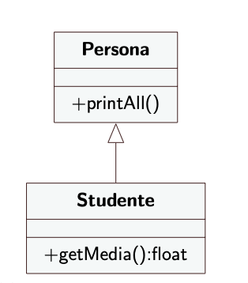
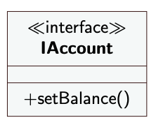

# 4° lezione IDS

Due Date: March 12, 2025
Status: Done
Argomenti: OOP, Refactoring
Categoria Desing Pattern: Desing Pattern Comportamentali, Desing Pattern Creazionali, Desing Pattern di Refactoring

## 2° metodo di refactoing (Sostituisci Temp con Query)

La tecnica **"Sostituisci Temp con Query"** è un principio di refactoring in cui una **variabile temporanea** utilizzata per memorizzare il risultato di un'espressione viene sostituita con un metodo che restituisce direttamente quel valore.

Le **variabili temporanee** (temp) sono locali al metodo in cui sono definite. Questo significa che, se vogliamo utilizzare quel valore in più punti, dobbiamo mantenere tutto il codice all'interno dello stesso metodo. Di conseguenza, i metodi diventano **più lunghi e meno leggibili**.

Se il valore è incapsulato in una variabile temporanea, **solo quel metodo può accedervi**. Se invece lo spostiamo in un metodo separato (query), allora **qualsiasi parte del codice può richiamarlo** senza dover duplicare la logica.

### **Perché farlo?**

- **Migliora la leggibilità**: Il codice diventa più chiaro e descrittivo.
- **Evita ripetizioni**: Se il valore è necessario in più punti, possiamo richiamare il metodo invece di ridefinire la variabile.
- **Facilita la manutenzione**: Se l'espressione cambia, basta aggiornare il metodo senza dover cercare tutte le occorrenze della variabile.

Spesso il refactoring **"Sostituisci Temp con Query"** è il **primo passo** prima di applicare **"Estrai Metodo"**.

- **Sostituire la variabile temporanea** ci permette di spezzare metodi complessi in parti più piccole.
- Una volta che il calcolo è incapsulato in un metodo, possiamo **estrarre ulteriori metodi** e migliorare ancora la leggibilità.

## Come procedere (T con Q)

1. Cercare una variabile temporanea assegnata solo una volta 
2. dichiaro `temp` `final` in java non è necessario assegnare  il valore allo costsante qundo si dichiara ma lo si può fare anche in un secondo momento l’inportante e che lo si faccia subito
3. Compilare (per verificare che è assegnata una volta sola)
4. Estrarre la parte destra dell’assegnazione e creare un metodo

### Esempio

```java
private double quantita, prezzo;
public double getPrezzo1() {
	double prezzoBase = quantita * prezzo;
	double sconto;
	if (prezzoBase > 1000) sconto = 0.95;
	else sconto = 0.98;
return prezzoBase * sconto;
}

```

```java

private double quantita, prezzo;

public double getPrezzo2() {
	return prezzoBase() * sconto();
}

private double prezzoBase() {
	return quantita * prezzo;
}

private double sconto() {
	if (prezzoBase() > 1000) 
		return 0.95;
	return 0.98;
}
```

---

## 3° metodo di refactoring (Dividi Variabile Temp)

Si ha una variabile temporanea che è pensata per scopi diversi. Questa tecnica suggerisce di usare due variabili non di usarne una per tutto

```java
// non si capisce cosa fa il metodo
double temp = 2 * (height + width);
System.out.println(temp);
temp = height * width;
System.out.println(temp);
```

Diventa

```java
final double perim = 2 * (height + width); // se si ha una sola assegnazione
System.out.println(perim);
final double area = height * width;
System.out.println(area);
```

A questo punto con la 2° tecnica questo calcolo può essere eseguito con un metodo

## Come procedere: 3° metodo

- Cambiare il nome della variabile temp al momento della
dichiarazione e alla sua prima assegnazione
- Dichiarare la nuova temp come final
- Cambiare tutti i riferimenti a temp fino alla sua seconda assegnazione
- Dichiarare una nuova temp per la seconda assegnazione
- Compilare e testare
- Ripetere per singoli passi, ogni passo rinomina una dichiarazione e cambia i riferimenti fino alla prossima assegnazione

### Esempio

```java
private double primaryForce, secondaryForce, mass, delay;
public double getDistanceTravelled1(int time) {
	double result;
	double acc = primaryForce / mass; // prima assegnazione
	int primaryTime = (int) Math.min(time, delay);
	result = 0.5 * acc * primaryTime * primaryTime;
	int secondT = (int) (time - delay);
	if (secondT > 0) {
		double primaryVel = acc * delay;
		acc = (primaryForce + secondaryForce) / mass; // seconda assegnazione
		result += primaryVel * secondT + 0.5 * acc * secondT * secondT;
	}
	return result;
}
```

Diventa

```java
public double getDistanceTravelled2(int time) {
double result;
final double primAcc = primaryForce / mass;
int primaryTime = (int) Math.min(time, delay);
result = 0.5 * primAcc * primaryTime * primaryTime;
int secondT = (int) (time - delay);
if (secondT > 0) {
	double primaryVel = primAcc * delay;
	final double secondAcc = (primaryForce + secondaryForce) / mass;
	result += primaryVel * secondT + 0.5 * secondAcc * secondT * secondT;
}
return result;
```

## 4° metodo di refactoring (Sposta Metodo)

Si ha un metodo in una classe che utilizza più attributi e operazioni di **un'altra classe**, piuttosto che della classe in cui è definito. Questo significa che il metodo **non è al posto giusto** e dovrebbe essere spostato nella classe più appropriata.

Non è semplice capire come usare questo metodo perché solitamente si ha codice misciato tra le due classi.

## Come procedere: 4° metodo

- Esaminare attributi e metodi usati dal metodo da spostare per
decidere se spostare anche questi (spostarli se sono usati solo dal
metodo trasferito)
- Controllare che il metodo da spostare non sia dichiarato anche in
superclassi e sottoclassi
- Dichiarare il metodo nella classe target
- Copiare il metodo nella classe target e sistemare le chiamate a
metodi della classe origine e della classe target
- Richiamare il metodo nella classe target con l’opportuno
riferimento
- Decidere se rimuovere il metodo originario o tenerlo per  delegare (chiamare al suo interno il nuovo metodo nell’altra classe)

## 5° metodo di refactoring (Estrai Classe)

Durante lo sviluppo di un'applicazione, è comune che una classe inizi con una singola responsabilità ma, con il tempo, cresca in modo eccessivo accumulando **troppi attributi e metodi**. Questo porta a classi **troppo grandi e difficili da mantenere**.

Un buon principio di progettazione è la **Single Responsibility Principle (SRP)**, che afferma che **una classe dovrebbe avere una sola responsabilità**. Se una classe fa più cose, potrebbe essere il momento di **separare le responsabilità creando una nuova classe**.

## **Quando Applicare Questo Refactoring?**

- **Troppi dati non correlati**: Se una classe contiene gruppi di dati che hanno poco a che fare tra loro.
- **Metodi che operano su un sottoinsieme di attributi**: Se alcuni metodi usano sempre solo alcuni attributi della classe, questi potrebbero appartenere a un'altra classe.
- **Modifiche frequenti su un sottoinsieme di dati**: Se un gruppo di attributi viene aggiornato spesso insieme, potrebbe essere logico spostarli in una nuova classe.

### Esempio

la classe Persona ha attributi per tenere prefisso e numero di telefono

# Ereditarietà nella OOP

L'ereditarietà è un concetto fondamentale della **programmazione orientata agli oggetti (OOP)** che permette di **riutilizzare il codice** definendo nuove classi basate su una classe esistente.

Se ci accorgiamo che una nuova classe deve comportarsi **esattamente come una classe già esistente**, ma con alcune **modifiche o funzionalità aggiuntive**, possiamo creare una **sottoclasse (subclass)**

## Perché Usare le Sottoclassi?

- **Riutilizzo del codice**: Non è necessario riscrivere da zero metodi e attributi comuni.
- **Migliore organizzazione**: Possiamo separare le funzionalità comuni in una classe base e le varianti in sottoclassi.
- **Facilità di espansione**: Possiamo aggiungere nuovi comportamenti senza modificare la classe originale.

## **Overriding: Ridefinire il Comportamento dei Metodi della Superclasse**

Quando una classe eredita da un'altra classe, acquisisce **tutti i suoi metodi (non è consentito eliminare metodi della classe base nella sottoclasse)**. Tuttavia, a volte può essere necessario **modificare il comportamento di un metodo ereditato** per adattarlo meglio alle esigenze della sottoclasse.

Questo processo si chiama **overriding** (sovrascrittura).

### Esempio

```java
public class Animale {
    public void verso() {
        System.out.println("L'animale fa un suono");
    }
}

public class Cane extends Animale {
    @Override
    public void verso() {
        System.out.println("Il cane abbaia: Bau Bau!");
    }
}
```

## Ereditarietà in UML

 



## Record

In Java esiste il **record**, si tratta di una classe speciale che è stata progettata per tenere dati immutabili. **Un record fornisce in modo automatico l’implementazione dei metodi getter dei suoi campi**, che sono final, quindi non modificabili dopo l’assegnazione

```java
**public record Esame(String materia, int voto) { }**
```

Viene fornito automaticamente un costruttore che assegna tutti i campi. 

Non vi sono metodi setter. 

Un record può implementare una interfaccia, ma non può estendere
classi; può avere campi static, metodi static, e metodi di oggetti

## Esempio

```java
import java.util.ArrayList;
import java.util.List;

public class Persona {
    public record Esame(String materia, int voto) {}

    private String nome, cognome;

    public Persona(String nome, String cognome) {
        this.nome = nome;
        this.cognome = cognome;
    }

    public void printAll() {
        System.out.println("Nome: " + nome + " " + cognome);
    }
}

class Studente extends Persona {
    private String matricola;
    private List<Esame> esami = new ArrayList<>();

    public Studente(String nome, String cognome, String matr) {
        super(nome, cognome);
        this.matricola = matr;
    }

    public void nuovoEsame(String m, int v) {
        esami.add(new Esame(m, v));
    }

    public double getMedia() {  // Cambiato float -> double
        if (esami.isEmpty()) return 0;
        double sum = 0;
        for (Esame e : esami) sum += e.voto();
        return sum / esami.size();
    }

    @Override
    public void printAll() {
        super.printAll();
        System.out.println("Matricola: " + matricola);
        for (Esame e : esami) {
            System.out.println(e.materia() + ": " + e.voto());
        }
        System.out.println("Media: " + getMedia());
    }
}

// Classe Main per testare il codice
public class MainEsami {
    public static void main(String[] args) {
        Studente studente = new Studente("Mario", "Rossi", "12345");
        studente.nuovoEsame("Matematica", 28);
        studente.nuovoEsame("Informatica", 30);
        studente.nuovoEsame("Fisica", 25);
        studente.printAll();
    }
}
```

## Interfacce

Un'interfaccia in Java rappresenta un contratto che le classi devono rispettare. Definisce solo la firma dei metodi, senza fornire un'implementazione concreta. Questo concetto permette di stabilire un tipo astratto che può essere implementato da più classi diverse, favorendo la flessibilità e il polimorfismo.

A differenza di una classe, un'interfaccia non può avere attributi non inizializzati e non prevede costruttori, poiché non può essere istanziata direttamente. Tuttavia, può contenere costanti, che sono automaticamente `public static final`. A partire da Java 8, è possibile dichiarare metodi con un'implementazione predefinita tramite la parola chiave `default`, mentre i metodi `static` possono essere chiamati direttamente sull'interfaccia.

### Esempio

Un esempio pratico di interfaccia potrebbe essere un’interfaccia `Animale`, che definisce i metodi `faiVerso()` e `mangia()`. Una classe `Cane` che implementa questa interfaccia dovrà fornire una definizione concreta per entrambi i metodi

```java
public interface Animale {
    void faiVerso();
    void mangia();
}

public class Cane implements Animale {
    @Override
    public void faiVerso() {
        System.out.println("Il cane abbaia: Bau Bau!");
    }

    @Override
    public void mangia() {
        System.out.println("Il cane mangia croccantini.");
    }
}

public class Main {
    public static void main(String[] args) {
        Animale mioCane = new Cane();
        mioCane.faiVerso();
        mioCane.mangia();
    }
}
```

## Interface UML



Si sta specificando un stereotipo.


## Classi Astratte

na classe astratta rappresenta un concetto intermedio tra una classe completamente implementata e un’interfaccia. Può contenere metodi con un'implementazione concreta, ma anche metodi dichiarati come `abstract`, ovvero senza corpo, che le sottoclassi dovranno obbligatoriamente implementare. Questo approccio è utile quando si vuole definire una struttura comune per un insieme di classi, lasciando alle sottoclassi la responsabilità di implementare alcuni dettagli specifici.

Un metodo astratto è utile perché può essere invocato all'interno della stessa classe astratta, permettendo di costruire un comportamento parziale che verrà completato nelle sottoclassi. Inoltre, i client che utilizzano oggetti di queste classi si aspettano di poter chiamare tali metodi, indipendentemente dalla loro implementazione specifica.

### Esempio

```java
public abstract class Libro {
	private String autore;
	protected List<Pagina> pagine;
	public abstract void inserisci(Pagina p);
	public String autore() {
		return autore;
	}
}
```