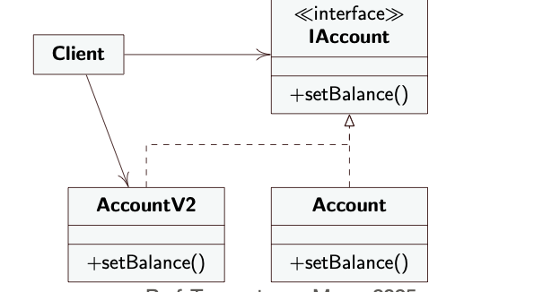

# 5° lezione IDS

Due Date: March 17, 2025
Status: Done
Argomenti: Desing Pattern, OOP
MicroArgomenti: Classi, Ereditarietà, Intrefaccia, Polimorfismo, Template Method

## Riepilogo

La notazione `@override` è una notazione inclusa nella libreria e fornisce al compilatore una informazione  aggiuntiva. Se c’è differenza tra nome passato e nome dell’interfaccia si  genera un errore. 

## Ereditarietà

- `private` (solo dalla stessa classe)
- `public` (da tutte)
- `protected` (dalla stessa classe e dalle sottoclassi)

Il nome della sottoclasse è, di norma, una parola composta es. `ArrayList` 

## Interfacce

Una interfaccia serve per la definizione di un tipo, senza alcun metodo da implementato (ci sono quelli già implementati con visibilità pubblica [poiché se fosse privato, nessuno lo potrebbe invocare]). Si mette lo stereotipo dove vi è l’interfaccia dell’UML. Si potrebbe avere un interfaccia senza dei metodi


## Classi Astratte

Una **classe astratta** è una classe che può contenere sia metodi implementati che non implementati. Si definisce utilizzando la parola chiave `abstract`.

Inoltre una classe astratta non può essere istanziata

In alcuni casi, possiamo fornire un'implementazione per alcuni metodi, mentre per altri non è possibile farlo direttamente. In questi casi, possiamo dichiarare i metodi come **astratti**, il che significa che le sottoclassi sono obbligate a fornirne un'implementazione concreta. Nell'UML, i metodi astratti vengono indicati in *corsivo*.

Inoltre, i metodi implementati all'interno di una classe astratta possono avere bisogno di invocare metodi astratti, delegando così parte della loro logica alle sottoclassi.

### Esempio

```java
public abstract class Libro {
    private String autore;
    protected List<Pagina> pagine;

    public Libro(String autore) {
        this.autore = autore;
        this.pagine = new ArrayList<>();
    }

    public abstract void inserisci(Pagina p);

    public String getAutore() {
        return autore;
    }

    public List<Pagina> getPagine() {
        return pagine;
    }
}

class Pagina {
    private String contenuto;

    public Pagina(String contenuto) {
        this.contenuto = contenuto;
    }

    public String getContenuto() {
        return contenuto;
    }
}

// Classe concreta che estende Libro e implementa inserisci()
class Romanzo extends Libro {
    public Romanzo(String autore) {
        super(autore);
    }

    @Override
    public void inserisci(Pagina p) {
        pagine.add(p);
    }
}

```

<aside>
💡

In UML, la freccia tratteggiata: eredita *l’interfaccia* mentre la freccia continua: eredita *la classe*

</aside>

Il metodo astratto viene scritto in corsivo

## Classi e interfaccia

Grazie all'**interfaccia**, le classi client possono implementare diversi sottotipi dell'interfaccia, rendendo così intercambiabili le implementazioni. Questo consente di scrivere codice più flessibile e modulare, poiché le classi client possono dipendere dall'interfaccia anziché da una specifica implementazione.

## La parola chiave `implements`

La parola chiave **`implements`** viene utilizzata per indicare che una classe implementa un'interfaccia. In questo modo, la classe si impegna a fornire un'implementazione concreta di tutti i metodi dichiarati nell'interfaccia.

### Esempio



```java
// Definizione dell'interfaccia IAccount
interface IAccount {
    void setBalance(double balance);
}

// Implementazione dell'interfaccia
public class AccountV2 implements IAccount {
    private double balance;

    @Override
    public void setBalance(double balance) {
        this.balance = balance;
        System.out.println("Saldo impostato a: " + balance);
    }

    public double getBalance() {
        return balance;
    }
}

```

### Esempio Completo

```java
// Classe base Persona
public class Persona {
    private String nome;
    private String cognome;

    public Persona(String nome, String cognome) {
        this.nome = nome;
        this.cognome = cognome;
    }

    public void printAll() {
        System.out.println("Nome: " + nome + ", Cognome: " + cognome);
    }
}

// Classe derivata Studente
public class Studente extends Persona {
    private String matricola;
    private Map<String, Integer> esami; // Materia -> Voto dict

    public Studente(String nome, String cognome, String matricola) {
        super(nome, cognome);
        this.matricola = matricola;
        this.esami = new HashMap<>();
    }

    public void nuovoEsame(String materia, int voto) {
        esami.put(materia, voto);
    }

    public float getMedia() {
        if (esami.isEmpty()) 
	        return 0;
        int somma = 0;
        for (int voto : esami.values()) {
            somma += voto;
        }
        return (float) somma / esami.size();
    }

    @Override
    public void printAll() {
        super.printAll();
        System.out.println("Matricola: " + matricola);
        System.out.println("Esami sostenuti:");
        for (Map.Entry<String, Integer> entry : esami.entrySet()) {
            System.out.println("- " + entry.getKey() + ": " + entry.getValue());
        }
        System.out.println("Media voti: " + getMedia());
    }
}

// Classe Main per testare il codice
public class MainEsami {
    public static void main(String[] args) {
        Studente s = new Studente("Alan", "Rossi", "M12345");
        s.nuovoEsame("Italiano", 8);
        s.nuovoEsame("Fisica", 7);
        s.printAll();

        // Polimorfismo: una variabile di tipo Persona può contenere un oggetto Studente
        Persona p = s;  
        p.printAll(); // Grazie al polimorfismo, viene chiamato il printAll() di Studente
    }
}

```

```java
public class MainEsami {
    public static void main(String[] args) {
        Studente s = new Studente("Alan", "Rossi", "M12345");
        s.nuovoEsame("Italiano", 8);
        s.nuovoEsame("Fisica", 7);
        s.printAll();

        // Polimorfismo: una variabile di tipo Persona può contenere un oggetto Studente
        Persona p = s;  
        p.printAll(); // Grazie al polimorfismo, viene chiamato il printAll() di Studente
    }
}
```

In questo caso si ha un tipo a compile-time e uno a run-time

- A compile - time: La variabile `p` è dichiarata di tipo **`Persona`**, quindi il compilatore sa che può chiamare solo i metodi definiti in `Persona` (o ereditati).
- A run-time: L'oggetto effettivo a cui `p` fa riferimento è un'istanza di **`Studente`**, che ha una sua implementazione di `printAll()`.
- Grazie al **dynamic method dispatch**, viene chiamato il metodo `printAll()` di `Studente`, non quello di `Persona`.

Il `MAP` serve a definire un dizionario chiave→valore 

- `private Map<String, Integer> esami` definizione
- **`esami.put(materia, voto);`** aggiunta

```java
for (Map.Entry<String, Integer> entry : esami.entrySet()) {
            System.out.println("- " + entry.getKey() + ": " + entry.getValue());
    }
//Map.Entry<String, Integer> entry : esami.entrySet() modo per accedere alla chiave e al valore 
```

## Considerazioni

Il metodo `printAll()` è un esempio di **override** a tempo di esecuzione, ovvero una ridefinizione di un metodo ereditato da una classe superiore.

In Java, esiste un tipo speciale chiamato **`Object`**, che rappresenta la superclasse di tutte le classi. Ogni classe in Java, anche se non lo dichiara esplicitamente, **estende automaticamente `Object`**, ereditandone i metodi.

Tra i metodi principali della classe `Object`, troviamo:

- **`toString()`** → Restituisce una rappresentazione testuale dell'oggetto.
- **`equals(Object obj)`** → Confronta due oggetti per verificarne l'uguaglianza.
- **`hashCode()`** → Restituisce un codice hash usato nelle strutture dati come `HashMap`.

Poiché tutte le classi ereditano da `Object`, possono ridefinire (`@Override`) questi metodi per personalizzarne il comportamento.

## Diagramma UML di Sequenza

Illustra cosa avverrà a run-time. Quindi quando lo eseguo c’è una evoluzione durante il processo (definibile come *evoluzione temporale*). Nel diagramma abbiamo bisogno di simboli per le istanze. Quindi:

- **Rettangolo**: istanza o classe che dipende dal contenuto. Se una lettera `A` è una classe mentre `:A` è una istanza. Con `o:A` si ha che `o` è l’istanza. e’ possibile utilizzar solo il nome :nome della classe indicando l’istanza
- **Linea tratteggiata**: vita dell’istanza (cioè che è presente a run-time)
- **Il rettangolo sovrapposto**: si chiama **barra di attivazione**.
- **Linea con freccia annerita**: nome del metodo invocato


Nel diagramma di sequenza, il tempo scorre **verticalmente dall’alto verso il basso** (*top-down*), rappresentando l’ordine degli eventi nel tempo.

- Una **linea continua** indica la chiamata di un metodo di una **sottoclasse** o un’istanza specifica.
- Una **linea tratteggiata** rappresenta la fine della chiamata del metodo, indicando il ritorno del controllo al chiamante.


La freccia ricorsiva: chiama un metodo della stessa istanza (va sulla superclasse, quindi prima avvio su Studente e poi vado sulla sua superclasse)

## Binding

Il **binding** è il processo con cui il compilatore (o il runtime) associa una chiamata a un metodo con il metodo effettivo che verrà eseguito.

## Differenza tra Early Binding e Late Binding

**Early Binding(Static Binding)** 

Un metodo chiamato viene deciso a compile-time, si usa con metodi `static`,`private ****`o `final`.  Non consente il polimorfismo.

**Late Binding (Dynamic Binding)**

Il metodo chiamato viene deciso **a runtime,** Il metodo chiamato viene deciso **a runtime,** Consente polimorfismo tramite **override.**

| Binding  | Quando avviene? | Deciso a… | Supporta Polimorfismo? |
| --- | --- | --- | --- |
| **Early Binding** | Compile time | Compile-time | ❌ No |
| **Late Binding** | Run-time  | Runtime | ✅ Sì |

### Esempio con Early Binding

```java
class Persona {
    void printAll() { // Metodo normale (senza override)
        System.out.println("Sono una Persona");
    }
}

class Studente extends Persona {
    void printAll() { // Metodo con lo stesso nome, ma non override
        System.out.println("Sono uno Studente");
    }
}

public class Main {
    public static void main(String[] args) {
        Persona p = new Persona();
        Studente s = new Studente();

        p.printAll(); // Output: Sono una Persona
        s.printAll(); // Output: Sono uno Studente
    }
}

```

Cosa succede?

- Il metodo `printAll()` viene deciso **a compile-time**.
- Non c'è polimorfismo: il compilatore sa già quale metodo chiamare.
- Anche se `Studente` ha lo stesso metodo, non sta **sovrascrivendo** (`override`) il metodo della superclasse.

### Esempio con Late Binding (Polimorfismo)

```java
import java.util.Random;

class Persona {
    void printAll() { // Metodo da sovrascrivere
        System.out.println("Sono una Persona");
    }
}

class Studente extends Persona {
    @Override
    void printAll() { // Override per polimorfismo
        System.out.println("Sono uno Studente");
    }
}

public class Main {
    public static void main(String[] args) {
        Persona p = new Persona();
        Studente s = new Studente();
        Persona px; // Dichiarazione del riferimento

        Random rand = new Random();
        int i = rand.nextInt(2); // Genera casualmente 0 o 1

        if (i == 0) {
            px = p; // px punta a un oggetto Persona
        } else {
            px = s; // px punta a un oggetto Studente
        }

        px.printAll(); // Metodo deciso a runtime
    }
}
```

**Cosa succede?**

- `px` è un riferimento di tipo `Persona`, ma può **puntare a `Persona` o `Studente`**.
- La scelta dipende da `i`, che viene deciso **a runtime**.
- Il metodo **giusto** viene chiamato grazie al **dynamic method dispatch** di Java.

## Polimorfismo

Il **polimorfismo** nella **Programmazione Orientata agli Oggetti (OOP)** è un principio che permette di utilizzare un'unica interfaccia per rappresentare diversi tipi di dati o comportamenti.

## Sottoclassi e Dispatch

Il **dynamic method dispatch** in Java determina **a runtime** quale metodo eseguire tra quelli ridefiniti nelle sottoclassi. Questo è il cuore del **late binding**, ovvero il meccanismo che decide quale metodo chiamare in base al **tipo reale** dell'oggetto, e non in base al tipo della variabile di riferimento.passata ovviamente. Il Dispatch risponde alla domanda “di chi è questa chiamata?”.

```java
public class Account {
    protected float balance = 0; // Saldo iniziale

    public void setBalance(float amount) {
        System.out.println("in Account set-balance");
        if (check(amount)) // Controlla se l'importo è valido prima di aggiungerlo
            balance += amount;
    }

    public boolean check(float amount) {
        System.out.println("in Account check");
        return balance + amount >= 0; // Controlla che il saldo non diventi negativo
    }
}
public class SavingAccount extends Account {
	public boolean check(float amount) {
		System.out.println("in Saving-Account check");
		return (balance + amount) >= 1000;
	}
}
	public class AccTest {
		public static void main(String[] args) {
			Account acc = new SavingAccount();
			acc.setBalance(1234);
	}
}
```

## Tipi di Variabili e Tipi a Runtime

Ogni volta che dichiaro una variabile, quella può contenere un’istanza dello stesso tipo o di una minore della gerarchia stessa (es. `float p = 2`). Il casting può essere fatto per forzare i dati, ma ovviamente non si può fare inserendo nella “scatoletta” particolari le informazioni della “scatoletta” generale. Il cast si può usare in contesti del tipo `Studente s = (Studente) p` dove `p` è di tipo *Persona* ma con istanza di tipo *Studente*.  

N.B. Ovviamente il tipo a run-time rimane tale, può variare l’istanza però.

## Cosa sono i Desing Pattern?

I **Design Pattern** sono soluzioni di progettazione ampiamente collaudate e utilizzate per sviluppare sistemi software in modo efficiente e strutturato. Si tratta di schemi riutilizzabili che aiutano a risolvere problemi comuni di progettazione, migliorando la manutenibilità, la scalabilità e la comprensibilità del codice.

## **Design Pattern: Template Method**

### **Qual è l’obiettivo?**

Il **Template Method** definisce la struttura generale di un algoritmo, lasciando che alcuni passaggi specifici vengano implementati successivamente nelle sottoclassi. Questo approccio consente di riutilizzare il codice comune, garantendo al contempo la flessibilità necessaria per personalizzare alcuni aspetti del comportamento.

### **Esempio**

Supponiamo di avere la necessità di leggere un file per aprire un documento. Il processo potrebbe includere i seguenti passaggi:

1. Verificare che il file esista.
2. Controllare se il file è del tipo corretto.

Alcuni di questi passaggi potrebbero essere implementati direttamente nella classe base, mentre altri potrebbero essere delegati alle sottoclassi per gestire esigenze specifiche.

## **Principio generale**

- Le **implementazioni generali** vengono definite nella classe principale.
- Le **parti più specifiche** sono implementate nelle sottoclassi, in base alle necessità.

In generale le implementazioni più generali si vanno a mettere nelle classi invece nelle sottoclassi si vanno a metter cose piu specifici

## **Design Pattern Template Method: Soluzione**

- **Abstract Class (Classe Astratta)**:
    
    Definisce la struttura generale dell'algoritmo, includendo il **Template Method** e i metodi astratti. Questi ultimi non sono implementati nella classe astratta, ma devono essere definiti nelle sottoclassi, forzandone così l'implementazione nelle classi derivate.
    
- **Concrete Class (Classe Concreta)**:
    
    Implementa i **metodi primitivi** richiesti dalla classe astratta. Quando si crea un'istanza della classe concreta e si chiama il **Template Method**, vengono eseguiti i metodi definiti nella sottoclasse, personalizzando il comportamento dell'algoritmo con dettagli specifici.
    

## **Funzionamento**

All'interno della **superclasse (classe astratta)** si definiscono i metodi che il Template Method può chiamare. Questi metodi sono **astratti**, quindi devono essere implementati nelle **sottoclassi**, che forniranno una specifica implementazione in base alle esigenze.

### Esempio Generale

```java
public abstract class AbstractClass{
	public void templateMethod(){
		primitiveOperation1();
		primitiveOperation2();
	}
	protected abstract void primitiveOperation1();
	protected abstract void primitiveOperation2();
	
}
public class ConcreteClass extends AbstractClass{
	protected void primitiveOperation1() {
		
	}
	protected void primitiveOperation2() {
		
	}
}
```

### Esempio


Quando si implementa una **classe astratta**, non si deve tener conto delle sue **sottoclassi** specifiche. La superclasse deve definire solo la struttura generale e le operazioni astratte, lasciando alle sottoclassi la responsabilità di fornire implementazioni concrete.

## **Riassumendo**

- **Riutilizzo del codice**:
    
    Il **Template Method** favorisce il riuso del codice, permettendo di definire una struttura generale riutilizzabile nelle classi astratte, mentre i dettagli specifici vengono implementati nelle sottoclassi.
    
- **Principio dell'inversione delle dipendenze**:
    
    Una classe superiore (**superclasse**) non dovrebbe dipendere direttamente dalle sue sottoclassi. In altre parole, la superclasse non deve conoscere gli attributi delle sottoclassi, ma può interagire con esse tramite la chiamata ai loro metodi astratti, che saranno implementati nelle classi concrete.