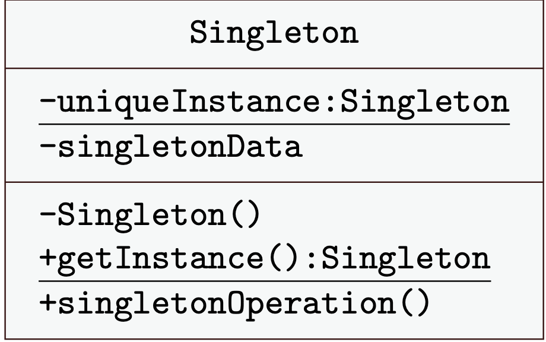

# 6° lezione IDS

Due Date: March 19, 2025
Status: Done
Argomenti: Desing Pattern
MicroArgomenti: Multiton, Singleton

# Design pattern

I **Design Pattern** sono soluzioni architetturali che indicano le classi necessarie per risolvere un problema specifico e le relazioni tra di esse. **Non** sono soluzioni esclusivamente per sistemi a oggetti, ma modelli di progettazione generali.

Non si riferiscono:

- **né** ad algoritmi,
- **né** al codice scritto all'interno di una classe,
- **né** a semplici condizioni o regole.

I **Design Pattern** vengono chiamati **micro-architetture** perché offrono soluzioni a problemi di progettazione che riguardano un numero limitato di classi, solitamente non più di dieci. Quando si sviluppa un sistema software che inizia a diventare grande, non è necessario utilizzare tutti i pattern. Questi pattern sono più utili quando si progettano sistemi complessi e si affrontano problemi specifici che sorgono durante lo sviluppo. Ogni pattern fornisce una guida su come organizzare un piccolo gruppo di classi, risolvendo in modo mirato determinati problemi senza sovraccaricare l'architettura del sistema.

Questi sono stati documentati perché affrontano e risolvono **problemi ricorrenti** che si presentano frequentemente durante lo sviluppo software. Ogni volta che ci si trova a gestire un determinato problema, è necessario organizzare una serie di oggetti in modo efficiente. I Design Pattern offrono una guida su come fare questa organizzazione, suggerendo come strutturare le classi e le loro interazioni per risolvere quel problema in maniera ottimale. 

## Come si descrive un algoritmo che deve valere sempre anche se si hanno piccole variazioni ad ogni passo?

Per descrivere un algoritmo che deve rimanere valido anche in presenza di piccole variazioni ad ogni passo, è necessario organizzare la logica in modo che la struttura generale dell'algoritmo resti invariata, mentre i dettagli specifici possano essere adattati in modo flessibile. In pratica, si deve riutilizzare la descrizione delle attività in ogni fase, modificando solo i controlli. Questo approccio consente di mantenere la coerenza complessiva dell'algoritmo, pur permettendo modifiche puntuali nei singoli passaggi.

Inoltre, offrono soluzioni ben documentate, frutto di un'analisi accurata delle conseguenze derivanti dalle scelte adottate. Questo processo di documentazione dettagliata permette non solo di applicare la soluzione al contesto specifico, ma anche di comprendere le implicazioni di tali scelte, rendendo il sistema facilmente manutenibile nel tempo. Un ulteriore vantaggio è che l'utilizzo di un Design Pattern fornisce feedback utili sulle conseguenze della strutturazione, aiutando a prendere decisioni più consapevoli e a migliorare la qualità del software nel lungo periodo.

- **Real time**
- **Sistemi distribuiti:**  le soluzioni che saranno discusse in questo corso dovranno essere addate all’utilizzo dei sistemi distribuiti prestando particolare attenzione alla **concorrenza** delle azioni tra più nodi(`sincronized` […]), per evitare conflitti e garantire l'affidabilità del sistema.
- **Sistemi concorrenti**
- **Sistemi centralizzati**: ciò di cui parleremo

Si potrebbe tentare di trovare una soluzione approssimativa di un problema senza conoscere i **Design Pattern**, ma senza avere consapevolezza delle **conseguenze** che questa scelta comporta. La soluzione offerta dai pattern, invece, è ottima non solo per l'efficacia pratica, ma anche per la **documentazione dettagliata** che la accompagna, rendendo più facile comprenderne l'uso e le implicazioni. Non è banale arrivare a questa consapevolezza, poiché i pattern rappresentano soluzioni collaudate e ben analizzate.

Questa conoscenza ci permette di evitare di **reinventare delle cose**, come ad esempio scrivere codice da zero per problemi già risolti. Inoltre, i Design Pattern ci aiutano a trovare soluzioni in tempi ragionevoli, anche per problemi complessi.

Le soluzioni che offrono non sono necessariamente **le più semplici**, ma sono le più **adatte** al contesto. Una soluzione più semplice potrebbe produrre solo poche righe di codice e una maggiore velocità iniziale, ma potrebbe non prevedere i **potenziali errori** o le complicazioni che potrebbero emergere in futuro.

Un ulteriore beneficio dei Design Pattern è che forniscono un **vocabolario comune** tra i progettisti. Invece di descrivere ogni dettaglio di un design con termini complessi o imprecisi, usando il vocabolario dei pattern, è possibile esplicitare rapidamente quale **pattern** si intende applicare. Questo rende la comunicazione tra i membri del team più chiara e coerente, facilitando la comprensione reciproca delle scelte progettuali.

I problemi che forniscono le soluzione al design pattern sono molto pochi e quindi è più semplice individuarle.

<aside>
💡

**Domanda orale**: Come si inquadra un design pattern? Si presenta un problema e il design pattern ci offre una guida sul come risolverlo

</aside>

## Descrizione di un pattern

Quando si ha un catalogo di un design pattern viene descritto in varie parti (nome, porzione, descrizione). E’ composto da:

- **Nome**: permette di identificare il design pattern
- **Intento**: descrive brevemente l’obiettivo (che la prima volta che lo vediamo sembra non capibile a primo sguardo)
- **Problema**: il contesto specifico in cui il pattern è applicabile. Spesso si tratta di una situazione in cui è necessario **bilanciare esigenze contrastanti**, come ottimizzare le prestazioni senza compromettere la manutenibilità. Per comprendere meglio il problema, si fa riferimento a guide avanzate che ne analizzano le caratteristiche e le proprietà.
- **Soluzione**: rappresenta la struttura del pattern, ovvero il modello di relazione tra le classi e i loro ruoli. Questa parte include l'uso di **ereditarietà, associazioni e responsabilità tra gli oggetti**, stabilendo chiaramente **quali operazioni vengono eseguite e come interagiscono le varie componenti**. L'obiettivo è trovare un compromesso efficace tra le esigenze del problema e la flessibilità della soluzione.
- **Conseguenze**: analizza gli effetti dell'adozione del pattern, mettendo in evidenza i vantaggi ottenuti e gli eventuali svantaggi. Questa sezione aiuta a capire **se il pattern è davvero la scelta migliore per il problema in questione**, valutando aspetti come la scalabilità, la semplicità e la complessità introdotta.

Le cinque parti fondamentali che descrivono un **Design Pattern** non includono il codice, perché il **Design Pattern non mira a riutilizzare codice**, ma piuttosto a **illustrare una soluzione** a un problema di progettazione. Non si tratta di un'implementazione diretta, ma di una descrizione strutturata del modo in cui le classi e gli oggetti dovrebbero interagire per risolvere una determinata esigenza. Il codice è solo una **conseguenza** dell’applicazione del pattern, non il suo scopo primario.

L'idea di **Design Pattern** trae ispirazione dall'architettura tradizionale. Il concetto nasce dagli studi dell'architetto **Christopher Alexander**, che ha elaborato una serie di soluzioni ricorrenti nella progettazione di edifici, chiese e altri spazi urbani. I progettisti software hanno preso spunto dai suoi libri per applicare lo stesso principio alla programmazione, strutturando modelli di progettazione che potessero essere riutilizzati per affrontare problemi comuni nello sviluppo software.

## Organizzazione

I **Design Pattern** vengono suddivisi in tre principali categorie, ciascuna con un obiettivo specifico nella progettazione del software:

- **Creazionali**: si concentrano sulla gestione della **creazione degli oggetti**, offrendo soluzioni per instanziare classi in modo flessibile ed efficiente. Questi pattern aiutano a risolvere problemi legati alla creazione di istanze, permettendo di separare la logica di costruzione dell’oggetto dalla sua rappresentazione. Tra i più noti troviamo **Factory Method**, **Singleton**, **Abstract Factory**, **Prototype** e **Builder** (quest'ultimo non verrà trattato in questo corso).
- **Strutturali**: individuano le classi del sistema software. Alcuni esempi di questa categoria sono **Adapter**, **Facade**, **Proxy**, **Composite** e **Decorator**.
- **Comportamentali**: riguardano l’**incapsulamento degli algoritmi e delle responsabilità tra oggetti**. Pur facendo riferimento alle classi strutturali, mettono in evidenza la separazione delle responsabilità e facilitano la gestione del **flusso di esecuzione del programma**.Tra i più noti troviamo **Strategy**, **Observer**, **Command**, **State** e **Template Method**.

## Desing Pattern Strutturali Vs Comportamentali

La differenza tra **Design Pattern Strutturali** e **Comportamentali** può sembrare sottile, ma in realtà riguarda l'approccio con cui vengono gestite le relazioni tra oggetti e la logica di esecuzione del codice.

- I **pattern strutturali** si concentrano principalmente su **come** le classi e gli oggetti sono organizzati, con l'obiettivo di definire la loro struttura e la loro interazione. Si occupano di come combinare diverse classi e oggetti per formare una struttura più grande e complessa, mantenendo una buona organizzazione e riducendo la complessità.
- I **pattern comportamentali**, invece, si focalizzano sul **come** gli oggetti **interagiscono tra loro** e su come il flusso di esecuzione del programma è gestito. Questi pattern descrivono la sequenza di operazioni, come vengono scambiati i messaggi e come vengono gestiti i comportamenti degli oggetti in situazioni dinamiche.
- I **pattern creazionali**, invece, risolvono problemi legati alla creazione degli oggetti. Quando si lavora con questi pattern, l'obiettivo è **controllare il processo di istanziazione**, evitando di dover utilizzare direttamente `new` in molte parti del codice. In questo modo, si evitano dipendenze rigide sull'implementazione concreta, garantendo maggiore flessibilità e manutenibilità. Un altro aspetto fondamentale dei **pattern creazionali** è la capacità di **nascondere la logica di selezione della classe da istanziare**, applicando il **principio di dipendere da un’interfaccia piuttosto che da una specifica implementazione**. Questo approccio riduce l’accoppiamento tra le componenti del software, facilitando l'estensibilità del codice e la gestione delle modifiche nel tempo.

## Classi e Oggetti

I **sistemi a oggetti** si basano sul concetto di **classe**, che rappresenta un modello astratto contenente **attributi** e **metodi**. Durante l'esecuzione del programma (*run-time*), vengono create **istanze** di queste classi, ovvero oggetti concreti che possiedono **valori specifici** per gli attributi definiti nella classe e che possono utilizzare i metodi associati.

Mentre le **classi** vengono definite staticamente durante la fase di **compilazione**, gli **oggetti** esistono solo a **run-time**. L’organizzazione del sistema si basa quindi sulle **relazioni tra gli oggetti**, che interagiscono tra loro per eseguire le operazioni richieste.

## Introduzione al Desing Pattern Singleton

Ritornando all’esempio della classe Pagamenti, supponiamo di voler avere una sola classe Pagamenti (che aveva una lista di valori leggibili da file e i metodi utili per il calcolo di massimo e totale) così da avere una classe che diventa sempre più grande (sfruttando le varie istanze della classe pagamenti), facendo si che la prima istanza legga il primo file, il secondo legge il secondo file ecc.  Il tutto è scomodo da leggere. Però come faccio a vincolare le altre parti del sistema software in modo che non possono crearsi un altra istanza della classe `Pagamenti` 

```java
public class ClientPagam { // versione 0.1
	public static void main(String[] args) {
		Pagamenti p = new Pagamenti(); // p è una istanza di Pagamenti
		p.leggiFile(“csvfiles", “Importi.csv"); // lettura primo file
	// p contiene tutti i valori letti dal file
		System.out.println("totale: " + p.calcolaSomma());
		System.out.println("max: " + p.calcolaMassimo());
	}
}
```

```java
public class ClientPagam { // versione 0.2
	public static void main(String[] args) {
		Pagamenti p = new Pagamenti(); // p e’ l’unica istanza
		p.leggiFile(“csvfiles", “Importi.csv"); // lettura primo file
		System.out.println("file 1 totale: " + p.calcolaSomma());
		System.out.println("file 1 max: " + p.calcolaMassimo());
		p.leggiFile(“csvfiles", “PagMarzo.csv”); // lettura secondo file
		// p adesso contiene tutti i valori letti da entrambi i file
		System.out.println("file 1 e 2 totale: " + p.calcolaSomma());
		System.out.println("file 1 e 2 max: " + p.calcolaMassimo());
	}
}
```

```java
public class MainPagam { // versione 0.3
	public static void main(String[] args) {
		Pagamenti p1 = new Pagamenti(); // prima istanza
		Pagamenti p2 = new Pagamenti(); // seconda istanza
		p1.leggiFile(“csvfiles", “Importi.csv"); // lettura primo file
		p2.leggiFile(“csvfiles", “PagMarzo.csv"); // lettura secondo file
		System.out.println("file 1 totale: " + p1.calcolaSomma());
		System.out.println("file 1 max: " + p1.calcolaMassimo());
		System.out.println("file 2 totale: " + p2.calcolaSomma());
		System.out.println("file 2 max: " + p2.calcolaMassimo());
	}
}
```

Questo problema lo affronta il **design pattern Singleton.** 

Supponiamo di avere una classe **Pagamenti**, che permette di aprire diversi file e calcolare la somma degli importi prelevati da ognuno di essi tramite il metodo `calcolaPagamenti()`. Se però non ci accorgiamo che la classe **non deve essere istanziata più di una volta**, potremmo rischiare di creare **più istanze** della classe **Pagamenti**, causando problemi di inconsistenza nei dati e gestione disordinata delle informazioni.

## Desing Pattern Singleton

Per garantire che la classe **`Pagamenti`** venga istanziata **una sola volta**, possiamo applicare il **Design Pattern Singleton**. Questo pattern assicura che ci sia **un'unica istanza** dell’oggetto e che sia accessibile **tramite un unico punto di accesso**.

L'obiettivo principale è **centralizzare le informazioni**, evitando la creazione di più oggetti **sparsi nel sistema**, che potrebbero portare a **incongruenze nei dati**. Se permettessimo la creazione di nuove istanze senza controllo, man mano che il software cresce, la gestione delle informazioni diventerebbe **più complessa e soggetta a errori**.

Per implementare un **Singleton**, bisogna seguire due regole fondamentali:

1. **Definire un metodo statico** che restituisce **sempre la stessa istanza** della classe.
2. **Rendere il costruttore privato**, in modo che l'istanza non possa essere creata direttamente da altre classi.



### Esempio Classe Singleton Fib


```java
public class Fib {       // classe che implementa un Singleton
  private static Fib obj = new Fib();  // istanza di Fib
  private int[] x = {1, 2, 3, 5, 8, 13, 21, 34, 55, 89, 144, 233};
  private int i;

  private Fib() {                     // costruttore privato
    i = 3;
  }
  public static Fib getInstance() {   // metodo della classe
    return obj;                       // restituisce l'unica istanza
  }
  public int getValue() {
    if (i<11) i++;
    return x[i-1];
  }
  public void revert() {
    i = 0;
  }
}

public class TestFib {
  public static void main(String[] args) {
    // richiede una istanza di Fib
    Fib f = Fib.getInstance();
    
    System.out.print("f "+f.getValue());
    System.out.println(" "+f.getValue());
    
    // richiede una nuova istanza
    Fib f2 = Fib.getInstance();
    
    System.out.print("f2 "+f2.getValue());
    System.out.println(" "+f2.getValue());
        
    // Si ha un errore a compile-time con:
    // Fib f3 = (Fib) f2.clone();
    // Fib f4 = new Fib();
  }
}
```

I membri `static` vengono inizializzati **una sola volta**, non appena la classe viene caricata nella memoria dalla Java Virtual Machine (JVM). Questo accade quando la classe viene utilizzata per la prima volta, cioè quando si accede alla classe (ad esempio, invocando un metodo `static` o accedendo a un campo `static`).

### Ulteriore Esempio


```java
public class Logs {
    private static Logs obj;
    private List<String> l = new ArrayList<>();

    private Logs() {
        empty();
    }

    public static Logs getInstance() {
        if (null == obj) obj = new Logs();
        return obj;
    }

    public void record(String s) {
        l.add(s);
    }

    public String dumpLast() {
        return l.get(l.size() - 1);
    }

    public String dumpAll() {
        String acc = "";
        for (String s : l) acc = acc.concat(s);
        return acc;
    }

    public void empty() {
        l.clear();
    }
}
```

## Desing Pattern Multiton

Il **Design Pattern Multiton** è una variante del **Singleton**, ma invece di garantire una sola istanza per tutta la classe, consente di avere un **insieme di istanze** distinte, ognuna associata a una chiave unica. Ogni chiave mappa a un'istanza specifica della classe. Questo è utile quando desideriamo avere un numero limitato di oggetti, ma ognuno con una propria istanza identificata da una chiave.

## Differenza tra Singleton e Multiton

- **Singleton**: Garantisce **una sola istanza** della classe per l'intero sistema.
- **Multiton**: Permette di creare **più istanze** della stessa classe, ma limitate a una per ciascuna chiave unica.

```java
public static Logs getIstance(){
	return new Logs();
}
```

Mentre prima era:

```java
public static Logs getIstance(){
	if(null == obj)
		obj = new Logs();
	return obj
}
```

Inoltre uso un contatore per contare il numero di istanze e quindi limitarle, con

```java
private static int count = 0;
//altre cose in mezzo

public static Logs getIstance(){
	if(count < 100)
		return new Logs();
	return null;
}
```

Da ciò di cui sopra si deduce che le modifiche da Singleton a Multiton sono minimali, in maniera tale che se si effettua un cambiamento, lo si può fare in maniera locale 

## Factory Method

Il **Factory Method** è un design pattern creazionale che consente di definire un'interfaccia per la creazione di oggetti, lasciando però alle sottoclassi il compito di decidere quale classe istanziare. In questo modo, il pattern permette di delegare la creazione degli oggetti alle classi derivate, fornendo una struttura flessibile e facilmente estendibile.

Un aspetto importante da considerare quando si parla di Factory Method è la differenza tra **librerie** e **framework**:

- Una **libreria** è un insieme di codice pronto all'uso che fornisce funzionalità specifiche per risolvere determinati problemi. Il programmatore può richiamare le funzioni di una libreria per usarle direttamente nel proprio codice.
- Un **framework**, al contrario, è un insieme di codice riutilizzabile che non fornisce soluzioni pronte per ogni necessità, ma offre una struttura e delle linee guida per costruire un'applicazione. È rivolto ai programmatori, che possono espandere e personalizzare il framework in base alle proprie esigenze, integrando codice nuovo con quello già fornito dal framework.

Nel contesto di un framework, potremmo avere una classe che è responsabile della creazione di istanze di altre classi. Tuttavia, il framework non sa in anticipo quale classe deve essere creata, poiché dipende dalle scelte fatte dal programmatore. Qui entra in gioco il **Factory Method**: il framework fornisce un metodo per la creazione dell'oggetto, ma lascia al programmatore (o alla sottoclasse) la responsabilità di determinare quale classe specifica deve essere utilizzata. In questo modo, il framework può restare generico, ma la creazione dell'oggetto avviene in modo flessibile.

**Il Factory Method** è un design pattern che aiuta a separare le implementazioni delle classi, permettendo che **non tutte le classi debbano conoscere tutto il programma**. Questo è un vantaggio importante in termini di **manutenibilità** e **estendibilità** del codice.

### Esempio

Un framework potrebbe definire un metodo astratto `createProduct()`, ma sarà il programmatore a definire quale classe concreta deve essere istanziata al momento dell'implementazione.

Nel **Factory Method**, la soluzione è composta da diverse componenti che lavorano insieme per separare la creazione degli oggetti dalla loro utilizzo. Le principali componenti della soluzione sono:

- **Product**:
    
    È l'interfaccia o classe astratta che definisce il tipo di oggetto che verrà creato. È un contratto che le classi concrete dovranno rispettare. Ogni "prodotto" creato dal **Factory Method** dovrà implementare questa interfaccia o estendere questa classe astratta.
    
- **ConcreteProduct**:
    
    Sono le classi concrete che implementano l'interfaccia o estendono la classe astratta definita nel **Product**. Ogni **ConcreteProduct** rappresenta una specifica implementazione di un prodotto che verrà creato dalla factory.
    
- **Creator**
    
    È la classe astratta o interfaccia che definisce il metodo factory (spesso chiamato `createProduct()`) che verrà utilizzato per creare i **ConcreteProduct**. La classe **Creator** può anche definire un'operazione (`Operation`) che utilizza il prodotto creato, ma non è responsabile della creazione diretta di oggetti concreti.
    
- **ConcreteCreator**
    
    È una sottoclasse concreta di **Creator** che implementa il metodo factory, decidendo quale classe concreta di prodotto creare. La classe **ConcreteCreator** è responsabile della creazione di oggetti specifici.
    
- **Client Classes**
    
    Sono le classi che utilizzano il **Creator** per ottenere un prodotto e lavorano con esso, senza preoccuparsi di come il prodotto è stato creato. Queste classi interagiscono principalmente con l'interfaccia del **Product** e chiamano i metodi dell'**Operation** definita nel **Creator**.
    

Un altro aspetto importante del **Factory Method** è che **il client non si preoccupa di quale classe concreta venga utilizzata**. Si affida alla factory per ottenere l'oggetto richiesto e utilizza il metodo o**peration()** definito nel **Creator** senza conoscere i dettagli della sua implementazione.