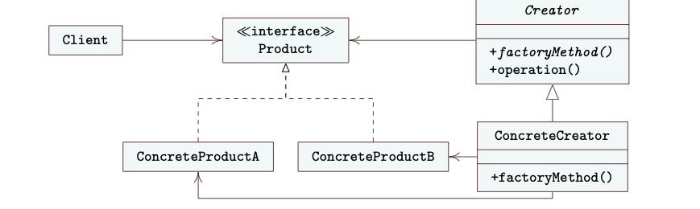
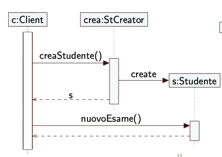
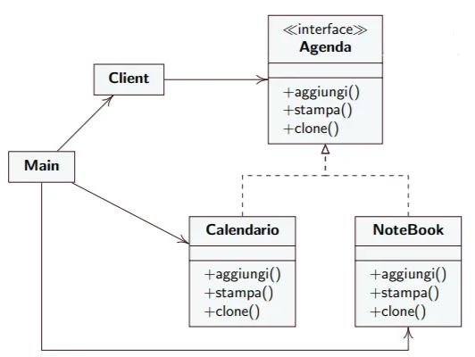

# 7° lezione IDS

Due Date: March 24, 2025
Status: Done
Argomenti: Desing Pattern
MicroArgomenti: Abstract Factory, Factory Method, Prototype

## Lezione Precedente

# Desing Pattern Factory Method



Quando si parla di interfaccia, non ci si riferisce a un’interfaccia in Java senza implementazione, ma a un meccanismo che collega due parti di un progetto, fungendo da collegamento tra moduli. Per raggiungere questo obiettivo, è necessario disporre di un'interfaccia senza implementazione, che definisca un tipo da utilizzare per realizzare il client. In questo modo, il client conoscerà il tipo e i metodi che può invocare sulle istanze create, garantendo che siano conformi a tale tipo.

La gerarchia più a sinistra serve a garantire la compatibilità dei tipi, in modo che il **Client** si leghi solo all’interfaccia senza conoscere le classi più specifiche. La parte più a destra, composta da **Creator** e **ConcreteCreator**, ha lo scopo di distribuire la creazione delle istanze in due parti:

1. **Creator** → Predispone certe operazioni e definisce l’interfaccia per la creazione degli oggetti.
2. **ConcreteCreator** → Conosce le istanze concrete e implementa la creazione effettiva degli oggetti, permettendo di inserire algoritmi riutilizzabili.

Esistono diverse varianti di questo **Design Pattern**:

1. **Prima variante** → Ogni **ConcreteCreator** è associato a un **ConcreteProduct** specifico. Questo approccio è semplice e ben strutturato, utile quando i tipi di prodotto sono noti e stabili. Se in futuro si prevede di introdurre nuovi prodotti, si potrà farlo aggiungendo nuovi creatori concreti.
2. **Seconda variante** → Esiste un unico **ConcreteCreator**, che decide dinamicamente quale **ConcreteProduct** istanziare, in base a parametri o condizioni specifiche (ad esempio un tipo, un codice o un’opzione passata). È utile quando i prodotti variano in modo controllato ma flessibile.
3. **Terza variante** → La creazione e la logica del prodotto sono incorporate direttamente nel **ConcreteCreator**, senza definire una classe separata per il **ConcreteProduct**. Questo riduce il numero di classi, ma può compromettere la modularità e rendere più difficile estendere il sistema.

### Cosa avviene a Run-Time?


- A **run-time**, il client, che è una parte esterna al design pattern, ha bisogno di un'istanza di un certo tipo e quindi chiama un metodo su **ConcreteCreator**.
- Il **ConcreteCreator** esegue la logica di creazione dell'istanza, spesso delegando parte del lavoro alla superclasse (**Creator**).
- Dopo aver creato l'oggetto, il **ConcreteCreator** può invocare il metodo `operation()`sulla superclasse.
- All'interno di questo metodo viene chiamato il `factoryMethod()`, che è un metodo astratto definito nella superclasse e implementato nelle sottoclassi.
- Poiché il **Creator** contiene un metodo astratto, non può essere istanziato direttamente. Il `factoryMethod()` viene eseguito dalla sottoclasse concreta (**ConcreteCreatorA** o **ConcreteCreatorB**), la quale utilizza l'operatore `new` per creare un'istanza di **ConcreteProductA** o **ConcreteProductB**.
- Questa istanza viene poi restituita prima al metodo `operation()` e successivamente al chiamante.
- Il client non è a conoscenza della classe concreta che è stata creata e lavora solo con l'interfaccia comune o la superclasse, garantendo un basso accoppiamento e maggiore flessibilità. In questo modo, il pattern **Factory Method** permette di separare la logica di creazione dell'oggetto, dalla sua effettiva implementazione, rendendo il codice più estendibile e mantenibile.
- **l riferimento all'istanza `cp` viene restituito a `ConcreteCreator`** → Si esce dalla chiamata di `factoryMethod()`(indicata dalla linea tratteggiata ricorsiva).
- **L'istanza `cp` viene restituita al Client** → Il client riceve l'istanza creata e può invocare `request()` su di essa.

### Esempi




```java
import java.util.*;

public interface Studente {
    public boolean nuovoEsame(String m, int v);
    public float getMedia();
}

class Esame {
    private String materia;
    private int voto;

    public Esame(String m, int v) {
        materia = m;
        voto = v;
    }

    public int voto() {
        return voto;
    }
}

public class StudenteAttivo implements Studente {
    private List<Esame> esami = new ArrayList<>();
    
    @Override 
    public boolean nuovoEsame(String m, int v) {
        esami.add(new Esame(m, v)); // materia -> voto
        System.out.println("Esame " + m + " Registrato");
        return true;
    }

    @Override 
    public float getMedia() {
        System.out.println("num esami: " + esami.size());
        if (esami.isEmpty()) return 0;
        float sum = 0;
        for (Esame e : esami) sum += e.voto();
        float media = sum / esami.size();
        System.out.println("media: " + media);
        return media;
    }
}

public class StBloccato implements Studente {
    private float media;
    
    public StBloccato(float m) {
        media = m;
    }

    @Override 
    public boolean nuovoEsame(String m, int v) {
        System.out.println("Non può sostenere esami");
        return false;
    }

    @Override 
    public float getMedia() {
        System.out.println("media: " + media);
        return media;
    }
}

public abstract class Creator {
    private int numIstanze = 0;
    
    public abstract Studente getStudente();
    
    public Studente creaStudente() {
        numIstanze++; 
        return getStudente();
    }

    public int getNum() { 
        return numIstanze; 
    }
    
    public abstract Studente ripristina(Studente s);
    
    public abstract Studente sospendi(Studente s);
}

public class StCreator extends Creator {
    private boolean attivo = true;
    private Map<Studente, Studente> bloccati = new HashMap<>();
    
    @Override 
    public Studente getStudente() {
        if (attivo) return new StudenteAttivo();
        return new StBloccato(0); // set the value of media
    }

    @Override 
    public Studente sospendi(Studente s) {
        Studente sosp = new StBloccato(s.getMedia());
        bloccati.put(sosp, s); // inset into the map
        return sosp;
    }

    @Override 
    public Studente ripristina(Studente s) {
        return bloccati.remove(s);
    }
}

public class Main {
    public static void main(String[] args) {
        // Creiamo il Creator che gestisce la creazione degli studenti
        StCreator stCreator = new StCreator();
        
        // Creiamo uno studente attivo
        Studente studenteAttivo = stCreator.creaStudente();
        studenteAttivo.nuovoEsame("Matematica", 28);
        studenteAttivo.nuovoEsame("Fisica", 30);
        System.out.println("Media studente attivo: " + studenteAttivo.getMedia());

        // Supponiamo che lo studente venga sospeso e quindi diventato bloccato
        Studente studenteBloccato = stCreator.sospendi(studenteAttivo);
        studenteBloccato.nuovoEsame("Chimica", 24);  // Questo non verrà eseguito poiché lo studente è bloccato
        System.out.println("Media studente bloccato: " + studenteBloccato.getMedia());
        
        // Ripristiniamo lo studente attivo
        Studente ripristinato = stCreator.ripristina(studenteBloccato);
        ripristinato.nuovoEsame("Informatica", 29);
        System.out.println("Media studente ripristinato: " + ripristinato.getMedia());
    }
}

```

Supponiamo di voler creare un'applicazione che gestisca la classe `Studente` e le sue sottoclassi, come `CarrieraAttiva` o `StudenteBloccato`. Ogni studente può trovarsi in vari stati, a seconda della sua situazione di iscrizione.

Sebbene si possano aggiungere ulteriori stati in futuro, l'obiettivo è evitare che queste modifiche impattino su tutte le altre parti del sistema software.

In questo scenario, il **Design Pattern Factory Method** ci viene in aiuto.

Utilizzando questo pattern, possiamo nascondere la complessità della creazione di oggetti specifici e fornire una semplice interfaccia.

L'interfaccia `Studente` definisce solo i metodi e le relative firme(signature), senza implementazioni concrete. In questo modo, le classi che implementano questa interfaccia si occuperanno della logica specifica per ogni tipo di studente.

Per esempio, l'interfaccia `Studente` potrebbe includere metodi come `nuovoEsame()` e `getMedia()`, con i relativi parametri di ingresso e uscita, ma senza che la logica venga definita direttamente nell'interfaccia. Le classi concrete come `CarrieraAttiva` o `StudenteBloccato` implementeranno poi questi metodi, ciascuna secondo la propria specifica situazione.

Questo approccio garantisce che eventuali modifiche o aggiunte di nuovi stati non abbiano effetti collaterali sulle altre parti del sistema, in quanto il codice che utilizza l'interfaccia `Studente` non dipende dalle implementazioni concrete, ma si interfaccia solo con i metodi definiti nell'interfaccia stessa.

Il **Design Pattern Factory Method** ci aiuta a centralizzare la logica di creazione degli oggetti, incapsulando questa responsabilità in un'unica parte del codice. Invece di decidere quale tipo di istanza creare direttamente in ogni parte del sistema, il Factory Method permette di delegare questa decisione a una classe che si occupa esclusivamente della creazione.

In questo caso, abbiamo due ruoli principali: il **Creator** e il **StCreator**. Il **Creator** è una classe astratta che definisce un metodo per ottenere un'istanza di `Studente`, ma non specifica quale tipo di studente debba essere creato. La classe **StCreator** estende `Creator` e decide se creare un'istanza di `StudenteAttivo` o `StudenteBloccato`, in base alla logica interna (un metodo `creaStudente()` o anche `getMedia()`).

Questo approccio permette di separare la logica di creazione delle istanze dalla logica di utilizzo delle stesse. Il codice che utilizza l'oggetto `Studente` non è a conoscenza di quale tipo specifico di studente venga creato, ma si interfaccia solo con l'interfaccia comune. Inoltre, se in futuro si vogliono aggiungere nuovi tipi di studenti, basterà modificare il `StCreator`senza dover modificare il resto del sistema. Si hanno inoltre, i metodi `sospendi()` e `ripristina()` che permetto il cambio di stato.

### Conseguenze

- Il codice delle classi dell’applicazione conosce solo l’interfaccia Product e può lavorare con qualsiasi ConcreteProduct. I ConcreteProduct sono facilmente intercambiabili
- Se si implementa una sottoclasse di Creator per ciascun
ConcreteProduct da istanziare si ha una proliferazione di classi

## Tecnica Dependency Injection

La **Dependency Injection** è una tecnica utilizzata per risolvere il problema della creazione delle istanze. Invece di creare direttamente le dipendenze all'interno di una classe, queste vengono fornite da un'entità esterna. 

Il **Factory Method** si presta bene a questa tecnica, poiché consente di delegare la creazione degli oggetti a una fabbrica esterna, invece di farlo direttamente nella classe che deve utilizzarli. In questo modo, un oggetto che ha bisogno di altre dipendenze non le crea da solo, ma si aspetta che qualcun altro gliele fornisca.

In questo scenario, il **client** è l'oggetto che ha bisogno di utilizzare altre istanze (dipendenze). La Dependency Injection **permette di separare la costruzione delle istanze dal loro utilizzo. Il client non è responsabile della creazione dell'istanza di cui ha bisogno.**

Ad esempio, nel caso sopra, l'istanza di `Studente` (ad esempio `s`) dovrebbe essere passata direttamente al costruttore di `Client`. Così, quando si istanzia il `Client`, gli viene fornita l'istanza di `Studente` tramite il costruttore.

Questo approccio porta maggiore **flessibilità**, poiché se si avessero sottoclassi di `Studente` (come `StudenteAttivo`, `StudenteBloccato`, ecc.), il client non dovrà modificare il proprio codice per adattarsi a una nuova versione di `Studente`. Può semplicemente ricevere una nuova implementazione tramite la Dependency Injection, senza dipendere da una specifica classe concreta. In pratica, **C** non conosce direttamente le sottoclassi di **S** (come `StudenteAttivo` o `StudenteBloccato`), ma si interfaccia con l'interfaccia comune. A runtime, però, l'istanza effettiva di `Studente` potrebbe essere una sottoclasse come `StudenteAttivo` o `StudenteBloccato`, permettendo al **client** di lavorare con l'oggetto appropriato senza dover conoscere la sua implementazione concreta. Si ha il **Concetto Wyning**

### Esempio


In questo scenario, possiamo applicare la **Dependency Injection** per fornire le dipendenze **Writer** e **PianoStudi** alla classe **Studente**. La classe **Studente** riceve nel suo costruttore le istanze di **Writer** e **PianoStudi**, ma conosce solo l'interfaccia o il tipo astratto **Writer**, non i suoi sottotipi. Questo garantisce che **Studente** rimanga indipendente dalle implementazioni concrete di **Writer** e **PianoStudi**, aumentando così la flessibilità e l'estensibilità del codice.

# Desing Pattern Abstract Factory


Il **Design Pattern Abstract Factory** è simile al **Factory Method**, poiché entrambi si occupano della creazione di oggetti attraverso un’interfaccia astratta, evitando di legare il codice alle classi concrete. Tuttavia, **l’Abstract Factory è più generalizzato**: è pensato per gestire **famiglie di oggetti correlati** che devono essere creati in modo coerente tra loro.

In altre parole, quando un oggetto appartiene a una determinata famiglia, tutti gli altri oggetti collegati devono essere scelti dalla **stessa famiglia**, per garantirne la compatibilità. L’obiettivo è **coordinare la creazione di oggetti correlati** senza doverli istanziare direttamente e senza conoscere le loro classi concrete.

L’Abstract Factory è utile, ad esempio, quando si vuole supportare più stili di interfaccia grafica (GUI). Una famiglia potrebbe includere bottoni, checkbox e finestre. Se si sceglie la famiglia "Windows", tutti i componenti creati (bottoni, checkbox, finestre) dovranno essere in stile Windows. Se si sceglie "Mac", tutti i componenti saranno in stile Mac. Questo garantisce **uniformità visiva e funzionale**.

### Differenze chiave rispetto al Factory Method:

- **Factory Method** crea un solo oggetto specifico.
- **Abstract Factory** crea **famiglie** di oggetti correlati.
- Entrambi promuovono l'uso di interfacce o classi astratte per disaccoppiare la creazione dal client.

## **Factory Method Vs Abstract Factory: Nomenclatura**

Nei pattern **Factory Method** e **Abstract Factory**, la terminologia utilizzata per indicare i prodotti può variare leggermente per chiarezza. Ecco una corrispondenza comune tra i due:

- **Factory Method**
    - `Product`: è un'interfaccia o classe astratta che definisce le operazioni comuni per un tipo di oggetto.
    - `ConcreteProduct`: è l'implementazione concreta del `Product`.
- **Abstract Factory**
    - `AbstractProduct`: viene utilizzato al posto di `Product` per evidenziare che si tratta di un'interfaccia astratta per una famiglia di prodotti.
    - `Product` (equivalente a `ConcreteProduct` nel Factory Method): è l'implementazione concreta di `AbstractProduct`.

### Esempio di corrispondenza:

- `Product` (Factory Method) → `AbstractProduct` (Abstract Factory)
- `ConcreteProduct` (Factory Method) → `Product` (Abstract Factory)

Quando lo sviluppatore ha la necessità di mantenere una coerenza tra diverse classi da istanziare, può organizzare il codice in due distinte gerarchie:

1. **Una gerarchia per un tipo di prodotto**, che chiameremo **A**. Questa rappresenta una famiglia di oggetti che condividono comportamenti e caratteristiche comuni.
2. **Una gerarchia per un altro tipo di prodotto**, chiamata **B**, che costituisce un'altra famiglia di oggetti correlati, ma con funzionalità o scopi differenti rispetto alla gerarchia A.

Per gestire in modo astratto la creazione di questi oggetti, si definisce un'interfaccia chiamata **AbstractFactory**, che espone metodi astratti per la creazione dei prodotti. Successivamente, si implementano le **ConcreteFactory**, che realizzano concretamente questi metodi, producendo le istanze specifiche delle classi delle due gerarchie.

<aside>
💡

***Suggerimento per la memorizzazione***

Quando si ha una gerarchia di **Product** con i vari **ConcreteProduct**, il concetto è simile a quello del **Factory Method**, ma qui si trova una duplicazione delle gerarchie. Questo accade perché, nell'**Abstract Factory**, ci sono più gerarchie di prodotti, una per ogni famiglia di oggetti correlati. 

</aside>

### Esempio

```java
interface Icon { // AbstractProductA
 public void draw();
 public void fill();
}

interface Text { // AbstractProductB
 public void tell();
 public void shout();
}

interface Creator { // AbstractFactory
 public Icon getIcon(); // create method
 public Text getText();
}

// ConcreteFactory
class Creator1 implements Creator {
 public Icon getIcon() {
 return new Circle();
 }
 public Text getText() {
 return new Japanese();
 }
}

// ConcreteFactory
class Creator2 implements Creator {
 public Icon getIcon() {
 return new Box();
 }
 public Text getText() {
 return new English();
 }
}

class Circle implements Icon { // ProductA1
 public void draw() {
 System.out.print("( ) ");
 }
 public void fill() {
 System.out.print("(o) ");
 }
}

class Box implements Icon { // ProductA2
 public void draw() {
 System.out.print("[ ] ");
 }
 public void fill() {
 System.out.print("[X] ");
 }
 
 public class Japanese implements Text { // ProductB1
	 public void tell() {
		 System.out.println("( Youkoso. Konnichiwa! Hajimemashite )");
	 }
	 public void shout() {
		 System.out.println("( Shizuka ni shite kudasai )");
	 }
 }
	
  public class English implements Text { // ProductB2
	 public void tell() {
		 System.out.println("::::: Welcome. Nice to meet you :::::");
	 }
	 public void shout() {
		 System.out.println("::::: Be quiet please! :::::");
	 }
	}
	
	public class AbsFactorTest {
	 public static void main(String args[]) {
		 Creator c = new Creator1(); // istanzio un Creator
		 Icon ic = c.getIcon();
		 Text t = c.getText();
		 ic.draw();
		 t.tell();
	 }
}}
```

## Object Pool

Un **Object Pool** è un contenitore di istanze già create, pronte per essere riutilizzate. Quando un client ha bisogno di un'istanza, invece di crearne una nuova, la recupera dal pool. Questo approccio consente di ottimizzare l'uso delle risorse e migliorare le prestazioni del sistema.

Il pool può avere una dimensione fissa o dinamica. 

1. **Nel primo caso**, se non ci sono istanze disponibili, il client deve attendere. 
2. **Nel secondo** caso, il pool può espandersi creando nuove istanze quando necessario, adattandosi così alle richieste del sistema.

Quando un client non ha più bisogno di un'istanza, questa viene restituita al pool, rendendola disponibile per altri utilizzi. Per garantire il corretto funzionamento, l'istanza può essere ripristinata a uno stato iniziale prima di essere riutilizzata.

L'implementazione di un Object Pool può avvalersi del **Factory Method**, che si occupa della creazione e gestione delle istanze. I client non devono occuparsi direttamente della creazione degli oggetti, ma devono solo richiederli e rilasciarli quando non servono più.

Per garantire un'unica gestione centralizzata del pool, spesso viene adottato il **Singleton Pattern**, evitando così la creazione di più pool separati e garantendo un accesso uniforme alle istanze disponibili.

## Esempio di Object Pool

```java
public interface Shape {
    void draw();
}

// ConcreteProduct: Circle
public class Circle implements Shape {
    @Override
    public void draw() {
        System.out.println("Disegnando un cerchio");
    }
}

// ConcreteProduct: Square
public class Square implements Shape {
    @Override
    public void draw() {
        System.out.println("Disegnando un quadrato");
    }
}

// Classe di test per verificare il funzionamento dell'Object Pool
public class Main {
    public static void main(String[] args) {
        CreatorPool pool = new CreatorPool();

        // Prelievo di una Shape dal pool
        Shape s1 = pool.getShape();
        s1.draw(); // Output: Disegnando un cerchio

        // Rilascio dell'istanza nel pool
        pool.releaseShape(s1);

        // Prelievo di un'altra Shape (riutilizzo dell'oggetto)
        Shape s2 = pool.getShape();
        s2.draw(); // Output: Disegnando un cerchio (riutilizzato)
    }
}

```

```java
import java.util.ArrayList;
import java.util.List;
// CreatorPool è un ConcreteCreator e implementa un Object Pool
public class CreatorPool {
	 private List<Shape> pool = new ArrayList<>();
	 // metodo factory che ritorna un oggetto prelevato dal pool
	 public Shape getShape() {
		 if (pool.size() > 0)
			 return pool.remove(0);
		 return new Circle();
	 }
	 // inserisce un oggetto nel pool
	 public void releaseShape(Shape s) {
		 pool.add(s);
	 }
}
```

# Design Pattern Prototype


L'obiettivo del pattern Prototype è permettere la creazione di nuovi oggetti copiando un'istanza esistente, evitando di specificare direttamente la classe dell'oggetto da generare. Questo risulta particolarmente utile quando è necessario creare un nuovo oggetto con uno stato iniziale simile a un altro già esistente, senza dover ricorrere alla sua ricostruzione manuale.

Creare un oggetto solitamente comporta la necessità di specificare una classe, generando un forte accoppiamento tra chi istanzia e la classe stessa. Questo accoppiamento rende difficile l'aggiunta di nuovi tipi, come avviene nel Factory Method, dove ogni nuova classe richiede un'estensione della gerarchia di Creator.

Nel pattern Prototype, invece, la creazione avviene attraverso la clonazione di un'istanza pre-esistente, riducendo le dipendenze e aumentando la flessibilità. Il client non è vincolato a conoscere la classe specifica degli oggetti da creare, poiché utilizza un'interfaccia comune. Questo approccio consente di registrare e rimuovere prototipi dinamicamente, specificare nuovi oggetti con valori diversi senza dover definire nuove classi e mantenere strutture complesse tramite composizione.

## Prototype Vs Factory Method

A differenza del Factory Method, il Prototype elimina la necessità di una gerarchia di Creator, dato che i nuovi oggetti vengono generati per clonazione. È possibile definire e modificare configurazioni dinamicamente, creando prototipi in fase di esecuzione.

## Design Pattern Prototype: Implementazione

Il metodo `clone()` permette di creare una nuova istanza di una classe senza doverla istanziare direttamente, favorendo così il disaccoppiamento tra il client e le classi concrete. Questo è un aspetto chiave del pattern Prototype, che consente di generare nuovi oggetti in modo flessibile e dinamico.

Utilizzare la clonazione riduce la dipendenza del client dalle classi specifiche, poiché esso interagisce esclusivamente con l'interfaccia comune `Prototype`. In questo modo, i prototipi possono essere registrati, modificati e rimossi senza necessità di alterare il codice del client, rendendo l'applicazione più estensibile.

Molti linguaggi di programmazione offrono un metodo `clone()` che esegue una **copia superficiale (shallow copy)**, mantenendo i riferimenti agli stessi oggetti anziché duplicarli. Tuttavia, in molti scenari è preferibile implementare una **copia profonda (deep copy)** per evitare la condivisione involontaria di riferimenti tra l'originale e il clone. Inoltre, i cloni potrebbero necessitare di un'inizializzazione, motivo per cui la classe prototipo può prevedere operazioni dedicate alla configurazione dei dati.

Grazie a questa strategia, è possibile creare configurazioni dinamiche sfruttando la clonazione per ottenere nuove istanze con stati predefiniti o leggermente modificati rispetto al prototipo originale.

## Prototype: Esempio

Si vuol tenere un’agenda di impegni, varie voci possono essere aggiunte all’agenda
Lo stato dell’agenda è l’insieme di impegni presi. Una nuova istanza dell’agenda deve poter avere accesso agli impegni precedentemente inseriti
In modo simile, si vogliono inserire note in un quaderno e accedere alle note precedenti quando si ha una nuova istanza di quaderno

Agenda è un Prototype: definisce l’operazione clone e le operazioni per le classi concrete
Calendario e NoteBook sono ConcretePrototype, implementano le operazioni (compresa la clone)
La classe Client chiama l’operazione di clonazione



```java
public interface Agenda {
 public void aggiungi(String evento, LocalDateTime data);
 public void stampa();
 public Agenda clone();
}

public class NoteBook implements Agenda {
 private List<String> note = new ArrayList<>();
 
 @Override 
 public void aggiungi(String evento, LocalDateTime t) {
	 note.add(evento + ", " + t.getDayOfWeek() + " " + t.getHour() + ":" + t.getMinute());
 }
 
 @Override 
 public void stampa() {
	 note.forEach(e -> System.out.println(e));
 }
 
 @Override
  public Agenda clone() {
	 // deep copy
	 List<String> n = new ArrayList<>();
	 n.addAll(note);
	 NoteBook notenew = new NoteBook();
	 notenew.note = n;
	 return notenew;
 }
}
```

## Esempio#2 Factory Method


```java
// Codice Java che implementa il design pattern Factory Method

// Posto e' un Product
public interface Posto {
	public String getPosizione();
	public int getCosto();
	public String getSettore();
}
```

```java
// Palco e' un ConcreteProduct
import java.util.Random;

public class Palco implements Posto {
	private final int numero;

	public Palco() {
		numero = new Random().nextInt(20) + 1;
	}

	@Override
	public int getCosto() {pu
		if (numero > 10) return 50;
		return 40;
	}

	@Override
	public String getPosizione() {
		return Integer.toString(numero);
	}

	@Override
	public String getSettore() {
		if (numero == 20) return "Centrale";
		if (numero > 10) return "Verde";
		return "Blu";
	}
}
```

```java
// Platea e' un ConcreteProduct
import java.util.Random;

public class Platea implements Posto {
	private final String[] nomi = { "A", "B", "C", "D", "E", "F" };
	private final int numero;
	private final int riga;

	public Platea() {
		numero = new Random().nextInt(10) + 1;
		riga = new Random().nextInt(5) + 1;
	}

	@Override
	public int getCosto() {
		if (numero > 5 && rigaMax()) return 100;
		if (numero > 5 && rigaMin()) return 80;
		return 60;
	}

	@Override
	public String getPosizione() {
		return nomi[riga].concat(Integer.toString(numero));
	}

	@Override
	public String getSettore() {
		if (riga == 0) return "Riservato";
		return "Normale";
	}

	private boolean rigaMax() {
		return (riga >= 1 && riga <= 4);
	}

	private boolean rigaMin() {
		return (riga == 0 || riga == 5);
	}
}
```

```java
// GnrPosizioni e' un Creator
import java.util.Set;
import java.util.TreeSet;
public abstract class GnrPosizioni { // versione 1.1
	private static final int MAXPOSTI = 100;
	private final Set< String > pst = new TreeSet< >(); // set di posti

  	// metodo che rimanda alla sottoclasse l'istanziazione della classe
	public Posto prendiNumero(int x) {
		if (pst.size() == MAXPOSTI) return null;
		// il chiamante dovrebbe controllare se null
		Posto p;
		do {  				  // fino a quando non trova un posto libero
			p = getPosto(x); // chiama metodo della sottoclasse
		} while (pst.contains(p.getPosizione()));
		pst.add(p.getPosizione());
		return p; 
	}

	public void printPostiOccupati() {
		for (String s : pst)
			System.out.print(s + " ");
	}

	// il metodo factory e' dichiarato ma non implementato
	public abstract Posto getPosto(int tipo);
}
```

```java
// Posizioni e' un ConcreteCreator con un metodo factory
public class Posizioni extends GnrPosizioni {
	// metodo factory che ritorna una istanza
	@Override
	public Posto getPosto(int tipo) {
		// crea l'istanza di un ConcreteProduct 
		if (1 == tipo) return new Palco();
		return new Platea();
	}
}
```

```java
// Biglietto e' un client del Product Posto
public class Biglietto {
	private String nome;
	private final Posto pos;
	
	public Biglietto(Posto p) {
		pos = p;
	}
	
	public void intesta(String s) {
		nome = s;
	}
	
	public String getDettagli() {
		return nome.concat(" ").concat(pos.getPosizione());
	}
	
	public String getNome() {
		return nome;
	}

	public int getCosto() {
		return pos.getCosto();
	}
}
```

```java
// Classe con il main che usa il ConcreteCreator
public class MainBiglietti {
	private static Posizioni cp = new Posizioni();

	public static void main(String[] args) {
		Posto pos = cp.prendiNumero(0);
		Biglietto b = new Biglietto(pos);
		b.intesta("Mario");
		System.out.println("Costo " + b.getCosto());

		new Biglietto(cp.prendiNumero(0));
		new Biglietto(cp.prendiNumero(0));
		cp.printPostiOccupati();
	}
}
```